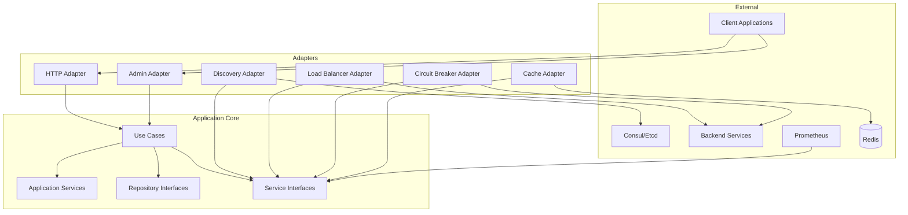
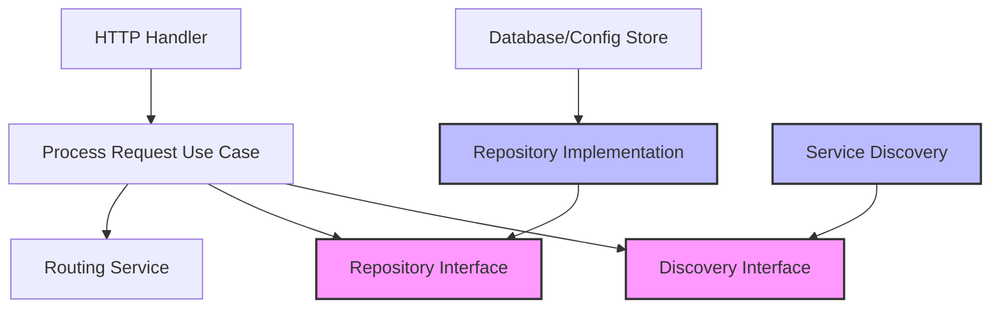

# API Gateway Architecture Documentation

## Table of Contents
1. [High-Level Architecture Overview](#high-level-architecture-overview)
2. [Project Structure](#project-structure)
3. [Application Bounded Context](#application-bounded-context)
4. [Architecture Patterns](#architecture-patterns)
5. [Technology Stack](#technology-stack)
6. [Cross-Cutting Concerns](#cross-cutting-concerns)
7. [API Design](#api-design)

---

## High-Level Architecture Overview

### Microservice Pattern
The API Gateway is designed as a standalone microservice responsible for managing all external API traffic and providing a unified entry point to the backend services. This approach provides:

- **Single Entry Point**: Centralized access control and routing for all client requests
- **Protocol Translation**: Seamless conversion between different protocols (HTTP/gRPC, REST/GraphQL)
- **Service Aggregation**: Combines multiple backend service responses into single client responses
- **Independent Scalability**: Can be scaled independently based on traffic volume and complexity
- **Technology Isolation**: Can use optimized technology stacks for high-performance routing
- **Fault Isolation**: Gateway failures don't directly impact backend services
- **Team Autonomy**: Dedicated teams can work on gateway concerns without coordinating with service teams

### Clean Architecture Principles (3-Layer)
Our implementation follows a simplified Clean Architecture approach with three distinct layers, optimized for API Gateway use cases:

```
┌─────────────────────────────────────────────────────────────┐
│                        Interfaces                           │
│  (HTTP Handlers, Route Controllers, Middleware, Presenters)  │
├─────────────────────────────────────────────────────────────┤
│                     Application                             │
│   (Use Cases, Services, Models, Repository Interfaces)      │
├─────────────────────────────────────────────────────────────┤
│                   Infrastructure                            │
│   (Load Balancers, Service Discovery, Caching, Monitoring)   │
└─────────────────────────────────────────────────────────────┘
```

**Dependency Rule**: Dependencies can only point inward. Outer layers depend on inner layers, but inner layers have no knowledge of outer layers.

**Key Design Decision**: No Domain Layer - For an API Gateway, the "business logic" is primarily request processing, routing, and infrastructure coordination rather than complex domain rules. This simplified approach reduces complexity while maintaining clean separation of concerns.

### Application-Driven Design Concepts
The API Gateway implements application-focused design principles:

#### Bounded Context
The **Gateway Application Context** encompasses:
- Request routing and forwarding logic
- Protocol translation and transformation processing
- Authentication and authorization enforcement
- Rate limiting and throttling policies
- Load balancing and service discovery coordination
- API composition and aggregation workflows
- Circuit breaking and fault tolerance mechanisms
- Request/response caching strategies

#### Ubiquitous Language
Key application terms used consistently across the gateway:
- **Route**: Mapping configuration from incoming request paths to backend services
- **Service**: Backend service endpoint representation with discovery and health information
- **Middleware**: Processing components that handle cross-cutting concerns
- **Policy**: Configuration rules for routing, security, and traffic management
- **Pipeline**: Ordered sequence of middleware applied to requests
- **Transformation**: Request/response modification and protocol conversion
- **Circuit**: Fault isolation mechanism for backend service protection
- **Endpoint**: Configured API route with specific behavior and policies

---

## Project Structure

```
api-gateway/
├── cmd/
│   └── main.go                    # Application entry point
├── internal/                      # Private application code
│   ├── application/               # Application layer (core logic)
│   │   ├── usecases/              # Use case implementations
│   │   │   ├── configure_route.go
│   │   │   ├── process_request.go
│   │   │   ├── forward_request.go
│   │   │   ├── transform_response.go
│   │   │   └── aggregate_response.go
│   │   ├── services/              # Application services
│   │   │   ├── routing_service.go
│   │   │   ├── transformation_service.go
│   │   │   ├── loadbalancing_service.go
│   │   │   ├── circuitbreaking_service.go
│   │   │   ├── ratelimiting_service.go
│   │   │   ├── authentication_service.go
│   │   │   └── caching_service.go
│   │   ├── models/                # Application models (simple structs)
│   │   │   ├── route.go
│   │   │   ├── service.go
│   │   │   ├── middleware.go
│   │   │   ├── policy.go
│   │   │   ├── pipeline.go
│   │   │   ├── circuit.go
│   │   │   ├── endpoint.go
│   │   │   └── request.go
│   │   ├── repositories/          # Repository interfaces
│   │   │   ├── route_repository.go
│   │   │   ├── service_repository.go
│   │   │   ├── policy_repository.go
│   │   │   └── cache_repository.go
│   │   ├── dto/                   # Data transfer objects
│   │   │   ├── requests/
│   │   │   │   ├── route_config.go
│   │   │   │   ├── service_config.go
│   │   │   │   └── policy_config.go
│   │   │   └── responses/
│   │   │       ├── gateway_response.go
│   │   │       └── health_response.go
│   │   └── validators/            # Request validation
│   │       ├── route_validator.go
│   │       └── service_validator.go
│   ├── infrastructure/            # Infrastructure layer
│   │   ├── persistence/           # Database implementations
│   │   │   ├── postgresql/
│   │   │   │   ├── route_repository.go
│   │   │   │   └── service_repository.go
│   │   │   └── migrations/
│   │   ├── cache/                 # Redis caching
│   │   │   └── redis_cache.go
│   │   ├── discovery/             # Service discovery
│   │   │   ├── consul/
│   │   │   ├── etcd/
│   │   │   └── kubernetes/
│   │   ├── loadbalancing/         # Load balancing algorithms
│   │   │   ├── round_robin.go
│   │   │   ├── weighted_round_robin.go
│   │   │   └── least_connections.go
│   │   ├── circuitbreaker/        # Circuit breaker implementations
│   │   │   ├── hystrix_circuit.go
│   │   │   └── custom_circuit.go
│   │   ├── monitoring/            # Monitoring and metrics
│   │   │   ├── prometheus/
│   │   │   └── jaeger/
│   │   └── security/              # Security implementations
│   │       ├── jwt.go
│   │       ├── oauth.go
│   │       └── rbac.go
│   ├── interface/                 # Interface layer
│   │   ├── http/                  # HTTP handlers
│   │   │   ├── handlers/
│   │   │   │   ├── gateway_handler.go
│   │   │   │   ├── config_handler.go
│   │   │   │   └── health_handler.go
│   │   │   ├── middleware/
│   │   │   │   ├── auth_middleware.go
│   │   │   │   ├── cors_middleware.go
│   │   │   │   ├── ratelimit_middleware.go
│   │   │   │   ├── circuitbreaker_middleware.go
│   │   │   │   └── logging_middleware.go
│   │   │   └── routes/
│   │   │       └── gateway_routes.go
│   │   ├── grpc/                  # gRPC handlers (if needed)
│   │   │   ├── gateway_server.go
│   │   │   └── interceptors/
│   │   └── admin/                 # Admin interface
│   │       ├── admin_handler.go
│   │       └── config_api.go
│   └── config/                    # Configuration
│       ├── config.go
│       ├── env.go
│       └── routes_config.go
├── pkg/                           # Public libraries
│   ├── errors/                    # Error definitions
│   ├── utils/                     # Utility functions
│   └── middleware/                # Reusable middleware
├── docker/                        # Docker configurations
│   ├── Dockerfile.dev
│   └── Dockerfile.prod
├── config/                        # Configuration files
│   ├── routes.yaml
│   ├── services.yaml
│   └── policies.yaml
├── documentation/                 # Documentation
├── tests/                         # Integration and E2E tests
├── scripts/                       # Build and deployment scripts
├── go.mod
├── go.sum
├── .air.toml                      # Air hot reload config
├── .gitignore
└── README.md
```

### Layer Responsibilities

#### Application Layer (`internal/application/`)
**Purpose**: Contains all gateway business logic, request processing workflows, and application models without complex domain abstractions.

- **Use Cases**: Gateway-specific workflows (request processing, route configuration, service management)
- **Application Services**: Business logic services that orchestrate gateway operations
- **Models**: Simple structs representing gateway concepts (Route, Service, Middleware, Policy)
- **Repository Interfaces**: Contracts for configuration and state persistence
- **DTOs**: Data transfer objects for external communication
- **Validators**: Input validation logic for configuration and requests

#### Infrastructure Layer (`internal/infrastructure/`)
**Purpose**: Provides technical implementations for application layer interfaces.

- **Persistence**: Configuration and state storage implementations
- **Service Discovery**: Backend service discovery mechanisms
- **Load Balancing**: Algorithm implementations for request distribution
- **Circuit Breaking**: Fault tolerance implementations
- **Monitoring**: Metrics collection and tracing implementations
- **Caching**: Performance optimization layers

#### Interface Layer (`internal/interface/`)
**Purpose**: Handles external communication and converts external formats to internal models.

- **HTTP Handlers**: Gateway endpoint implementations
- **Middleware**: Cross-cutting concerns for request processing
- **Admin Interface**: Configuration and monitoring endpoints
- **Routes**: Gateway routing configuration

---

## Application Bounded Context

### Application Models

#### Route Model
```go
type Route struct {
    ID           string    `json:"id"`
    Name         string    `json:"name"`
    Path         string    `json:"path"`
    Method       string    `json:"method"`
    ServiceID    string    `json:"service_id"`
    PipelineID   string    `json:"pipeline_id"`
    PolicyID     string    `json:"policy_id"`
    Enabled      bool      `json:"enabled"`
    Priority     int       `json:"priority"`
    CreatedAt    time.Time `json:"created_at"`
    UpdatedAt    time.Time `json:"updated_at"`
}
```

**Responsibilities**:
- Define request mapping rules
- Associate requests with backend services
- Specify processing pipeline and policies
- Manage route lifecycle and configuration

#### Service Model
```go
type Service struct {
    ID              string              `json:"id"`
    Name            string              `json:"name"`
    Protocol        string              `json:"protocol"`
    Endpoints       []Endpoint          `json:"endpoints"`
    LoadBalancer    LoadBalancerConfig  `json:"load_balancer"`
    Circuit         CircuitConfig       `json:"circuit"`
    HealthCheck     HealthCheckConfig   `json:"health_check"`
    DiscoveredAt    time.Time           `json:"discovered_at"`
    LastHealthCheck time.Time           `json:"last_health_check"`
}

type Endpoint struct {
    ID       string `json:"id"`
    Host     string `json:"host"`
    Port     int    `json:"port"`
    Weight   int    `json:"weight"`
    Healthy  bool   `json:"healthy"`
    Protocol string `json:"protocol"`
}
```

**Responsibilities**:
- Represent backend service configuration
- Manage service discovery and health
- Coordinate load balancing and circuit breaking
- Maintain service availability status

#### Middleware Model
```go
type Middleware struct {
    ID        string                 `json:"id"`
    Name      string                 `json:"name"`
    Type      string                 `json:"type"`
    Config    map[string]interface{} `json:"config"`
    Order     int                    `json:"order"`
    Enabled   bool                   `json:"enabled"`
    CreatedAt time.Time              `json:"created_at"`
    UpdatedAt time.Time              `json:"updated_at"`
}
```

**Responsibilities**:
- Define processing components
- Maintain middleware configuration
- Manage execution order and dependencies
- Handle middleware lifecycle

#### Pipeline Model
```go
type Pipeline struct {
    ID         string    `json:"id"`
    Name       string    `json:"name"`
    Middleware []string  `json:"middleware_ids"`
    Parallel   bool      `json:"parallel"`
    Timeout    int       `json:"timeout_ms"`
    CreatedAt  time.Time `json:"created_at"`
    UpdatedAt  time.Time `json:"updated_at"`
}
```

**Responsibilities**:
- Orchestrate middleware execution
- Define request processing flow
- Manage parallel vs sequential execution
- Handle pipeline timeouts and errors

### Application Services

#### RoutingService
```go
type RoutingService struct {
    routeRepo    RouteRepository
    serviceRepo  ServiceRepository
    cache        CacheRepository
    metrics      MetricsCollector
}

func (s *RoutingService) FindMatchingRoute(path string, method string) (*Route, error) {
    // Check cache first
    cacheKey := fmt.Sprintf("route:%s:%s", method, path)
    if route, err := s.cache.Get(cacheKey); err == nil {
        return route.(*Route), nil
    }
    
    // Find route from repository
    route, err := s.routeRepo.FindByPathAndMethod(path, method)
    if err != nil {
        return nil, err
    }
    
    // Cache the result
    s.cache.Set(cacheKey, route, time.Minute*5)
    
    // Record metrics
    s.metrics.IncrementRouteLookup(route.ID)
    
    return route, nil
}

func (s *RoutingService) ValidateRoute(route *Route) error {
    // Business validation logic
    if route.Path == "" {
        return ErrEmptyPath
    }
    
    if !isValidHTTPMethod(route.Method) {
        return ErrInvalidMethod
    }
    
    if route.ServiceID == "" {
        return ErrEmptyServiceID
    }
    
    // Validate path pattern
    if !isValidPathPattern(route.Path) {
        return ErrInvalidPathPattern
    }
    
    return nil
}

func (s *RoutingService) ResolveService(route *Route) (*Service, error) {
    service, err := s.serviceRepo.FindByID(route.ServiceID)
    if err != nil {
        return nil, fmt.Errorf("service not found: %w", err)
    }
    
    // Check if service has healthy endpoints
    if !s.hasHealthyEndpoints(service) {
        return nil, ErrNoHealthyEndpoints
    }
    
    return service, nil
}
```

#### TransformationService
```go
type TransformationService struct {
    transformers map[string]Transformer
    logger       Logger
}

func (s *TransformationService) TransformRequest(request *Request, config *TransformationConfig) (*Request, error) {
    transformer, exists := s.transformers[config.Type]
    if !exists {
        return nil, fmt.Errorf("unknown transformer type: %s", config.Type)
    }
    
    transformed, err := transformer.TransformRequest(request, config)
    if err != nil {
        s.logger.Error("Request transformation failed", 
            Field("error", err),
            Field("type", config.Type),
            Field("request_id", request.ID))
        return nil, fmt.Errorf("transformation failed: %w", err)
    }
    
    s.logger.Info("Request transformed successfully",
        Field("type", config.Type),
        Field("request_id", request.ID))
    
    return transformed, nil
}

func (s *TransformationService) TransformResponse(response *Response, config *TransformationConfig) (*Response, error) {
    transformer, exists := s.transformers[config.Type]
    if !exists {
        return nil, fmt.Errorf("unknown transformer type: %s", config.Type)
    }
    
    return transformer.TransformResponse(response, config)
}

func (s *TransformationService) ConvertProtocol(data []byte, from string, to string) ([]byte, error) {
    // Protocol conversion logic
    switch from {
    case "json":
        if to == "xml" {
            return s.jsonToXML(data)
        } else if to == "protobuf" {
            return s.jsonToProtobuf(data)
        }
    case "xml":
        if to == "json" {
            return s.xmlToJSON(data)
        }
    }
    
    return nil, fmt.Errorf("unsupported protocol conversion: %s to %s", from, to)
}
```

#### LoadBalancingService
```go
type LoadBalancingService struct {
    balancers  map[string]LoadBalancer
    metrics    MetricsCollector
    logger     Logger
}

func (s *LoadBalancingService) SelectEndpoint(service *Service, request *Request) (*Endpoint, error) {
    balancer, exists := s.balancers[service.LoadBalancer.Type]
    if !exists {
        return nil, fmt.Errorf("unknown load balancer type: %s", service.LoadBalancer.Type)
    }
    
    // Filter healthy endpoints only
    healthyEndpoints := make([]*Endpoint, 0)
    for _, endpoint := range service.Endpoints {
        if endpoint.Healthy {
            healthyEndpoints = append(healthyEndpoints, &endpoint)
        }
    }
    
    if len(healthyEndpoints) == 0 {
        return nil, ErrNoHealthyEndpoints
    }
    
    endpoint, err := balancer.SelectEndpoint(healthyEndpoints, request)
    if err != nil {
        return nil, fmt.Errorf("load balancing failed: %w", err)
    }
    
    // Record metrics
    s.metrics.IncrementLoadBalancingDecision(service.ID, endpoint.ID)
    
    return endpoint, nil
}

func (s *LoadBalancingService) UpdateEndpointHealth(endpointID string, health bool) error {
    // Update endpoint health in repository
    err := s.serviceRepo.UpdateEndpointHealth(endpointID, health)
    if err != nil {
        return fmt.Errorf("failed to update endpoint health: %w", err)
    }
    
    // Record metrics
    s.metrics.SetEndpointHealth(endpointID, health)
    
    s.logger.Info("Endpoint health updated",
        Field("endpoint_id", endpointID),
        Field("healthy", health))
    
    return nil
}
```

#### CircuitBreakingService
```go
type CircuitBreakingService struct {
    circuits map[string]*CircuitBreaker
    metrics  MetricsCollector
    logger   Logger
}

func (s *CircuitBreakingService) ExecuteWithCircuit(serviceID string, operation func() (*Response, error)) (*Response, error) {
    circuit, exists := s.circuits[serviceID]
    if !exists {
        // Create new circuit breaker for service
        circuit = NewCircuitBreaker(serviceID, s.getDefaultCircuitConfig())
        s.circuits[serviceID] = circuit
    }
    
    response, err := circuit.Execute(operation)
    if err != nil {
        // Check if circuit is open
        if circuit.State() == CircuitStateOpen {
            s.metrics.IncrementCircuitBreakerOpen(serviceID)
            return nil, ErrCircuitOpen
        }
        
        return nil, fmt.Errorf("operation failed: %w", err)
    }
    
    return response, nil
}

func (s *CircuitBreakingService) GetCircuitState(serviceID string) CircuitState {
    circuit, exists := s.circuits[serviceID]
    if !exists {
        return CircuitStateClosed
    }
    
    return circuit.State()
}

func (s *CircuitBreakingService) ConfigureCircuit(serviceID string, config *CircuitConfig) error {
    circuit := NewCircuitBreaker(serviceID, config)
    s.circuits[serviceID] = circuit
    
    s.logger.Info("Circuit breaker configured",
        Field("service_id", serviceID),
        Field("config", config))
    
    return nil
}
```

### Use Cases

#### ProcessRequest Use Case
```go
type ProcessRequestUseCase struct {
    routingService       *RoutingService
    transformationService *TransformationService
    loadBalancingService  *LoadBalancingService
    circuitBreakingService *CircuitBreakingService
    rateLimitingService   *RateLimitingService
    cachingService        *CachingService
    logger                Logger
    metrics               MetricsCollector
}

func (uc *ProcessRequestUseCase) Execute(request *Request) (*Response, error) {
    start := time.Now()
    defer func() {
        uc.metrics.RecordRequestDuration(time.Since(start))
    }()
    
    // 1. Find matching route
    route, err := uc.routingService.FindMatchingRoute(request.Path, request.Method)
    if err != nil {
        return nil, fmt.Errorf("route not found: %w", err)
    }
    
    // 2. Check rate limiting
    if !uc.rateLimitingService.Allow(request, route) {
        return nil, ErrRateLimitExceeded
    }
    
    // 3. Resolve service
    service, err := uc.routingService.ResolveService(route)
    if err != nil {
        return nil, fmt.Errorf("service resolution failed: %w", err)
    }
    
    // 4. Check cache for GET requests
    if request.Method == "GET" {
        if cached, err := uc.cachingService.Get(request.CacheKey()); err == nil {
            uc.metrics.IncrementCacheHit(route.ID)
            return cached, nil
        }
    }
    
    // 5. Apply request transformations
    if route.PipelineID != "" {
        transformedRequest, err := uc.applyRequestPipeline(request, route.PipelineID)
        if err != nil {
            return nil, fmt.Errorf("request pipeline failed: %w", err)
        }
        request = transformedRequest
    }
    
    // 6. Execute with circuit breaking
    response, err := uc.circuitBreakingService.ExecuteWithCircuit(service.ID, func() (*Response, error) {
        return uc.forwardRequest(request, service)
    })
    
    if err != nil {
        return nil, fmt.Errorf("request execution failed: %w", err)
    }
    
    // 7. Apply response transformations
    if route.PipelineID != "" {
        transformedResponse, err := uc.applyResponsePipeline(response, route.PipelineID)
        if err != nil {
            uc.logger.Error("Response pipeline failed", 
                Field("error", err),
                Field("route_id", route.ID))
            return response, nil // Return original response on transformation failure
        }
        response = transformedResponse
    }
    
    // 8. Cache response for GET requests
    if request.Method == "GET" && response.StatusCode == 200 {
        uc.cachingService.Set(request.CacheKey(), response, time.Minute*5)
    }
    
    // 9. Record metrics
    uc.metrics.IncrementRequestSuccess(route.ID, service.ID)
    
    return response, nil
}

func (uc *ProcessRequestUseCase) forwardRequest(request *Request, service *Service) (*Response, error) {
    // Select endpoint using load balancing
    endpoint, err := uc.loadBalancingService.SelectEndpoint(service, request)
    if err != nil {
        return nil, fmt.Errorf("endpoint selection failed: %w", err)
    }
    
    // Build target URL
    targetURL := fmt.Sprintf("%s://%s:%d%s", 
        endpoint.Protocol, endpoint.Host, endpoint.Port, request.Path)
    
    // Forward request
    response, err := uc.httpClient.Do(request, targetURL)
    if err != nil {
        uc.loadBalancingService.UpdateEndpointHealth(endpoint.ID, false)
        return nil, fmt.Errorf("request failed: %w", err)
    }
    
    // Mark endpoint as healthy
    uc.loadBalancingService.UpdateEndpointHealth(endpoint.ID, true)
    
    return response, nil
}
```

### Repository Interfaces

#### RouteRepository
```go
type RouteRepository interface {
    FindByID(id string) (*Route, error)
    FindByPathAndMethod(path string, method string) (*Route, error)
    FindAll() ([]*Route, error)
    FindEnabled() ([]*Route, error)
    Save(route *Route) error
    Update(route *Route) error
    Delete(id string) error
    Exists(id string) (bool, error)
    FindByServiceID(serviceID string) ([]*Route, error)
}
```

#### ServiceRepository
```go
type ServiceRepository interface {
    FindByID(id string) (*Service, error)
    FindByName(name string) (*Service, error)
    FindAll() ([]*Service, error)
    FindHealthy() ([]*Service, error)
    Save(service *Service) error
    Update(service *Service) error
    Delete(id string) error
    UpdateEndpointHealth(endpointID string, healthy bool) error
    AddEndpoint(serviceID string, endpoint *Endpoint) error
    RemoveEndpoint(serviceID string, endpointID string) error
}
```

---

## Architecture Patterns

### Hexagonal Architecture (Ports and Adapters)

The API Gateway implements hexagonal architecture to decouple application logic from external concerns:



#### Ports (Interfaces)
- **Repository Ports**: Configuration and state persistence interfaces
- **Service Ports**: External service interfaces (discovery, monitoring)
- **Gateway Ports**: Request processing interfaces
- **Cache Ports**: Caching abstraction interfaces

#### Adapters (Implementations)
- **Primary Adapters**: Drive the application (HTTP handlers, admin interface)
- **Secondary Adapters**: Implement ports for external dependencies (discovery, caching, monitoring)

### Dependency Inversion



**Key Principles**:
- High-level modules don't depend on low-level modules
- Both depend on abstractions (interfaces)
- Abstractions don't depend on details
- Details depend on abstractions

### SOLID Principles Implementation

#### Single Responsibility Principle
Each class has one reason to change:
- `RouteRepository` only handles route configuration persistence
- `LoadBalancingService` only handles request distribution
- `GatewayHandler` only handles HTTP request processing

#### Open/Closed Principle
Open for extension, closed for modification:
- New middleware types can be added without changing existing code
- New load balancing algorithms can be added through strategy pattern
- New protocols can be supported through adapter pattern

#### Liskov Substitution Principle
Subtypes must be substitutable for base types:
- Any `LoadBalancer` implementation can replace another
- `RoundRobinBalancer` and `LeastConnectionsBalancer` are interchangeable
- Any `CircuitBreaker` implementation can replace another

#### Interface Segregation Principle
Clients shouldn't depend on unused interfaces:
- `ReadOnlyRouteRepository` for read-only operations
- `WriteOnlyRouteRepository` for write operations
- `ReadOnlyServiceRepository` for service discovery
- `WriteOnlyServiceRepository` for service configuration

#### Dependency Inversion Principle
Depend on abstractions, not concretions:
- Use cases depend on repository interfaces, not implementations
- Infrastructure implements interfaces defined in application layer
- Services depend on discovery interfaces, not specific implementations

### CQRS Implementation

The gateway implements CQRS for performance and scalability:

```go
// Command side - Write operations
type RouteCommandHandler interface {
    CreateRoute(cmd CreateRouteCommand) error
    UpdateRoute(cmd UpdateRouteCommand) error
    DeleteRoute(cmd DeleteRouteCommand) error
    EnableRoute(cmd EnableRouteCommand) error
}

type ServiceCommandHandler interface {
    RegisterService(cmd RegisterServiceCommand) error
    UpdateServiceConfig(cmd UpdateServiceConfigCommand) error
    DeregisterService(cmd DeregisterServiceCommand) error
}

// Query side - Read operations
type RouteQueryHandler interface {
    GetRoute(query GetRouteQuery) (*RouteDTO, error)
    ListRoutes(query ListRoutesQuery) ([]*RouteDTO, error)
    FindMatchingRoutes(query FindMatchingRoutesQuery) ([]*RouteDTO, error)
}

type ServiceQueryHandler interface {
    GetService(query GetServiceQuery) (*ServiceDTO, error)
    ListHealthyServices(query ListHealthyServicesQuery) ([]*ServiceDTO, error)
    GetServiceMetrics(query GetServiceMetricsQuery) (*ServiceMetricsDTO, error)
}
```

**Benefits**:
- Optimized read and write models for different access patterns
- Independent scaling of configuration queries and request processing
- Clear separation of configuration management and request handling
- Better performance for high-volume request processing

---

## Technology Stack

### Core Framework and Language

#### Go 1.25+
**Rationale**:
- **Performance**: Excellent for high-throughput request routing and processing
- **Concurrency**: Built-in goroutines for handling simultaneous client requests
- **Networking**: Rich standard library for HTTP/gRPC protocol handling
- **Ecosystem**: Excellent libraries for web development, service discovery, and monitoring
- **Deployment**: Single binary deployment simplifies containerization and orchestration

#### Key Libraries
- **Gin Framework**: High-performance HTTP router with middleware support
- **gRPC-go**: Protocol Buffers and gRPC implementation for service communication
- **Consul API**: Service discovery and configuration management
- **Prometheus Client**: Metrics collection and monitoring
- **Jaeger Client**: Distributed tracing implementation
- **Redis Client**: High-performance caching and rate limiting
- **Viper**: Configuration management with multiple format support

### Configuration Storage

#### Primary Storage: PostgreSQL
**Rationale**:
- **ACID Compliance**: Critical for gateway configuration consistency
- **JSON Support**: Flexible storage for complex route and policy configurations
- **Performance**: Excellent for configuration read queries and updates
- **Scalability**: Connection pooling and replication support
- **Reliability**: Proven stability for production workloads

#### Configuration Schema Design
```sql
-- Routes table
CREATE TABLE routes (
    id UUID PRIMARY KEY DEFAULT gen_random_uuid(),
    name VARCHAR(255) NOT NULL,
    path VARCHAR(1000) NOT NULL,
    method VARCHAR(10) NOT NULL,
    service_id UUID NOT NULL REFERENCES services(id),
    pipeline_id UUID REFERENCES pipelines(id),
    policy_id UUID REFERENCES policies(id),
    enabled BOOLEAN DEFAULT true,
    priority INTEGER DEFAULT 0,
    created_at TIMESTAMP WITH TIME ZONE DEFAULT NOW(),
    updated_at TIMESTAMP WITH TIME ZONE DEFAULT NOW()
);

-- Services table
CREATE TABLE services (
    id UUID PRIMARY KEY DEFAULT gen_random_uuid(),
    name VARCHAR(255) UNIQUE NOT NULL,
    protocol VARCHAR(50) NOT NULL,
    load_balancer_type VARCHAR(50) DEFAULT 'round_robin',
    circuit_breaker_config JSONB,
    health_check_config JSONB,
    discovered_at TIMESTAMP WITH TIME ZONE DEFAULT NOW(),
    last_health_check TIMESTAMP WITH TIME ZONE DEFAULT NOW()
);

-- Service endpoints table
CREATE TABLE service_endpoints (
    id UUID PRIMARY KEY DEFAULT gen_random_uuid(),
    service_id UUID NOT NULL REFERENCES services(id) ON DELETE CASCADE,
    host VARCHAR(255) NOT NULL,
    port INTEGER NOT NULL,
    weight INTEGER DEFAULT 1,
    healthy BOOLEAN DEFAULT true,
    created_at TIMESTAMP WITH TIME ZONE DEFAULT NOW()
);

-- Middleware table
CREATE TABLE middleware (
    id UUID PRIMARY KEY DEFAULT gen_random_uuid(),
    name VARCHAR(255) NOT NULL,
    type VARCHAR(100) NOT NULL,
    config JSONB NOT NULL,
    order_index INTEGER NOT NULL,
    enabled BOOLEAN DEFAULT true,
    created_at TIMESTAMP WITH TIME ZONE DEFAULT NOW()
);

-- Pipelines table
CREATE TABLE pipelines (
    id UUID PRIMARY KEY DEFAULT gen_random_uuid(),
    name VARCHAR(255) NOT NULL,
    middleware_ids UUID[] DEFAULT '{}',
    parallel BOOLEAN DEFAULT false,
    timeout_ms INTEGER DEFAULT 30000,
    created_at TIMESTAMP WITH TIME ZONE DEFAULT NOW()
);

-- Indexes for performance
CREATE INDEX idx_routes_path_method ON routes(path, method);
CREATE INDEX idx_routes_service_id ON routes(service_id);
CREATE INDEX idx_routes_enabled ON routes(enabled);
CREATE INDEX idx_service_endpoints_service_id ON service_endpoints(service_id);
CREATE INDEX idx_service_endpoints_healthy ON service_endpoints(healthy);
```

### Service Discovery Integration

#### Consul Integration
**Rationale**:
- **Dynamic Discovery**: Automatic service registration and deregistration
- **Health Checking**: Built-in health check mechanisms
- **Configuration Management**: Distributed configuration storage
- **Multi-Datacenter**: Support for distributed deployments
- **DNS Interface**: Simple service resolution

#### Service Registration
```go
type ServiceRegistration struct {
    ID       string            `json:"id"`
    Name     string            `json:"name"`
    Tags     []string          `json:"tags"`
    Address  string            `json:"address"`
    Port     int               `json:"port"`
    Meta     map[string]string `json:"meta"`
    Check    *AgentServiceCheck `json:"check"`
}

type AgentServiceCheck struct {
    HTTP                           string        `json:"http"`
    TLSSkipVerify                  bool          `json:"tls_skip_verify"`
    Interval                       string        `json:"interval"`
    Timeout                        string        `json:"timeout"`
    DeregisterCriticalServiceAfter string        `json:"deregister_critical_service_after"`
}
```

### Caching Layer

#### Redis
**Rationale**:
- **Performance**: In-memory storage for low-latency access
- **Data Structures**: Rich data types for different caching needs
- **Persistence**: Optional disk persistence for durability
- **Clustering**: Horizontal scaling support
- **TTL Support**: Automatic key expiration for cache management

**Caching Strategies**:
- Route configuration caching
- Service discovery caching
- Response caching for GET requests
- Rate limiting state
- Circuit breaker state

### Monitoring and Observability

#### Prometheus Metrics
```go
type GatewayMetrics struct {
    RequestCount        *prometheus.CounterVec
    RequestDuration     *prometheus.HistogramVec
    ResponseSize        *prometheus.HistogramVec
    ErrorCount          *prometheus.CounterVec
    ActiveConnections   prometheus.Gauge
    CircuitBreakerState *prometheus.GaugeVec
    ServiceHealth       *prometheus.GaugeVec
}

var (
    RequestTotal = prometheus.NewCounterVec(
        prometheus.CounterOpts{
            Name: "gateway_requests_total",
            Help: "Total number of requests processed by the gateway",
        },
        []string{"method", "route", "service", "status_code"},
    )
    
    RequestDuration = prometheus.NewHistogramVec(
        prometheus.HistogramOpts{
            Name: "gateway_request_duration_seconds",
            Help: "Request processing duration in seconds",
            Buckets: prometheus.DefBuckets,
        },
        []string{"method", "route", "service"},
    )
)
```

#### Jaeger Distributed Tracing
```go
type TracingConfig struct {
    ServiceName    string        `json:"service_name"`
    CollectorURL   string        `json:"collector_url"`
    SamplerType    string        `json:"sampler_type"`
    SamplerParam   float64       `json:"sampler_param"`
    MaxPacketSize  int           `json:"max_packet_size"`
    BufferFlush    time.Duration `json:"buffer_flush"`
}

type SpanContext struct {
    TraceID   string
    SpanID    string
    ParentID  string
    Baggage   map[string]string
    Flags     byte
}
```

---

## Cross-Cutting Concerns

### Authentication and Authorization

#### JWT-Based Authentication
```go
type AuthenticationMiddleware struct {
    jwtService    JWTService
    rbacService   RBACService
    excludePaths  []string
}

func (m *AuthenticationMiddleware) Authenticate() gin.HandlerFunc {
    return func(c *gin.Context) {
        // Skip authentication for excluded paths
        if m.isExcludedPath(c.Request.URL.Path) {
            c.Next()
            return
        }
        
        token := extractToken(c)
        claims, err := m.jwtService.ValidateToken(token)
        if err != nil {
            c.JSON(401, ErrorResponse{Error: "Invalid token"})
            c.Abort()
            return
        }
        
        // Check authorization
        if !m.rbacService.IsAuthorized(claims, c.Request) {
            c.JSON(403, ErrorResponse{Error: "Insufficient permissions"})
            c.Abort()
            return
        }
        
        c.Set("user_claims", claims)
        c.Next()
    }
}
```

#### API Key Authentication
```go
type APIKeyAuth struct {
    keyStore   APIKeyStore
    keyHeaders []string
}

func (a *APIKeyAuth) ValidateAPIKey(c *gin.Context) (*APIKeyInfo, error) {
    key := a.extractAPIKey(c)
    if key == "" {
        return nil, ErrMissingAPIKey
    }
    
    keyInfo, err := a.keyStore.GetKeyInfo(key)
    if err != nil {
        return nil, ErrInvalidAPIKey
    }
    
    if !keyInfo.Active {
        return nil, ErrInactiveAPIKey
    }
    
    return keyInfo, nil
}
```

### Rate Limiting

#### Token Bucket Rate Limiter
```go
type RateLimiter interface {
    Allow(key string) bool
    GetRemainingTokens(key string) int
    Reset(key string)
    SetLimit(key string, limit int, window time.Duration)
}

type GatewayRateLimiter struct {
    globalLimiter   RateLimiter  // Global gateway rate limit
    perServiceLimit map[string]RateLimiter
    perClientLimit  map[string]RateLimiter
    redis           *redis.Client
}

func (r *GatewayRateLimiter) CheckRateLimit(request *Request, route *Route) bool {
    // Check global rate limit
    if !r.globalLimiter.Allow("global") {
        return false
    }
    
    // Check service-specific rate limit
    serviceKey := fmt.Sprintf("service:%s", route.ServiceID)
    if !r.perServiceLimit[serviceKey].Allow(serviceKey) {
        return false
    }
    
    // Check client-specific rate limit
    clientKey := fmt.Sprintf("client:%s", request.ClientID)
    if !r.perClientLimit[clientKey].Allow(clientKey) {
        return false
    }
    
    return true
}
```

#### Sliding Window Rate Limiter
```go
type SlidingWindowLimiter struct {
    store    Store
    window   time.Duration
    maxCount int
}

func (l *SlidingWindowLimiter) Allow(key string) bool {
    now := time.Now()
    windowStart := now.Add(-l.window)
    
    // Remove old entries
    l.store.RemoveBefore(key, windowStart)
    
    // Count current entries
    count := l.store.Count(key, windowStart, now)
    
    if count >= l.maxCount {
        return false
    }
    
    // Add current request
    l.store.Add(key, now)
    return true
}
```

### Circuit Breaking

#### Circuit Breaker Implementation
```go
type CircuitBreaker struct {
    name           string
    maxRequests    uint32
    interval       time.Duration
    timeout        time.Duration
    readyToTrip    func(counts Counts) bool
    onStateChange  func(name string, from State, to State)
    mutex          sync.Mutex
    state          State
    generation     uint64
    counts         Counts
    expiry         time.Time
}

type State int

const (
    StateClosed State = iota
    StateHalfOpen
    StateOpen
)

func (cb *CircuitBreaker) Execute(req *Request) (*Response, error) {
    generation, err := cb.beforeRequest()
    if err != nil {
        return nil, err
    }
    
    defer cb.afterRequest(generation, err == nil)
    
    // Execute the request
    response, err := cb.executeRequest(req)
    return response, err
}

func (cb *CircuitBreaker) beforeRequest() (uint64, error) {
    cb.mutex.Lock()
    defer cb.mutex.Unlock()
    
    now := time.Now()
    state, generation := cb.currentState(now)
    
    if state == StateOpen {
        return generation, ErrCircuitOpen
    } else if state == StateHalfOpen && cb.counts.Requests >= cb.maxRequests {
        return generation, ErrTooManyRequests
    }
    
    cb.counts.onRequest()
    return generation, nil
}
```

### Load Balancing

#### Load Balancer Interface
```go
type LoadBalancer interface {
    SelectEndpoint(endpoints []*Endpoint, request *Request) (*Endpoint, error)
    UpdateEndpointWeight(endpoint *Endpoint, weight int) error
    GetEndpointStats(endpoint *Endpoint) (*EndpointStats, error)
}

type RoundRobinBalancer struct {
    currentIndex int
    mutex        sync.Mutex
}

func (lb *RoundRobinBalancer) SelectEndpoint(endpoints []*Endpoint, request *Request) (*Endpoint, error) {
    lb.mutex.Lock()
    defer lb.mutex.Unlock()
    
    if len(endpoints) == 0 {
        return nil, ErrNoEndpointsAvailable
    }
    
    healthyEndpoints := getHealthyEndpoints(endpoints)
    if len(healthyEndpoints) == 0 {
        return nil, ErrNoHealthyEndpoints
    }
    
    endpoint := healthyEndpoints[lb.currentIndex%len(healthyEndpoints)]
    lb.currentIndex++
    return endpoint, nil
}

type WeightedRoundRobinBalancer struct {
    currentWeights map[string]int
    mutex          sync.Mutex
}

func (lb *WeightedRoundRobinBalancer) SelectEndpoint(endpoints []*Endpoint, request *Request) (*Endpoint, error) {
    lb.mutex.Lock()
    defer lb.mutex.Unlock()
    
    var bestEndpoint *Endpoint
    var maxCurrentWeight int
    var totalWeight int
    
    for _, endpoint := range endpoints {
        if !endpoint.Healthy {
            continue
        }
        
        currentWeight := lb.currentWeights[endpoint.ID] + endpoint.Weight
        lb.currentWeights[endpoint.ID] = currentWeight
        totalWeight += endpoint.Weight
        
        if currentWeight > maxCurrentWeight {
            maxCurrentWeight = currentWeight
            bestEndpoint = endpoint
        }
    }
    
    if bestEndpoint != nil {
        lb.currentWeights[bestEndpoint.ID] -= totalWeight
    }
    
    return bestEndpoint, nil
}
```

### Request/Response Transformation

#### Transformation Service
```go
type TransformationService struct {
    transformers map[string]Transformer
}

type Transformer interface {
    TransformRequest(request *Request, config *TransformationConfig) (*Request, error)
    TransformResponse(response *Response, config *TransformationConfig) (*Response, error)
}

type JSONTransformer struct{}

func (t *JSONTransformer) TransformRequest(request *Request, config *TransformationConfig) (*Request, error) {
    var data interface{}
    if err := json.Unmarshal(request.Body, &data); err != nil {
        return nil, err
    }
    
    transformed := t.applyTransformations(data, config.Rules)
    
    newBody, err := json.Marshal(transformed)
    if err != nil {
        return nil, err
    }
    
    request.Body = newBody
    return request, nil
}

func (t *JSONTransformer) TransformResponse(response *Response, config *TransformationConfig) (*Response, error) {
    // Similar transformation for response
    return response, nil
}
```

### Error Handling

#### Gateway-Specific Errors
```go
type GatewayError struct {
    Code      string `json:"code"`
    Message   string `json:"message"`
    Service   string `json:"service,omitempty"`
    Route     string `json:"route,omitempty"`
    Details   map[string]interface{} `json:"details,omitempty"`
    Timestamp time.Time `json:"timestamp"`
}

func (e GatewayError) Error() string {
    return e.Message
}

var (
    ErrServiceNotFound      = GatewayError{Code: "SERVICE_NOT_FOUND", Message: "Backend service not found"}
    ErrNoHealthyEndpoints   = GatewayError{Code: "NO_HEALTHY_ENDPOINTS", Message: "No healthy endpoints available"}
    ErrCircuitOpen         = GatewayError{Code: "CIRCUIT_OPEN", Message: "Circuit breaker is open"}
    ErrRateLimitExceeded   = GatewayError{Code: "RATE_LIMIT_EXCEEDED", Message: "Rate limit exceeded"}
    ErrInvalidRoute        = GatewayError{Code: "INVALID_ROUTE", Message: "Invalid route configuration"}
    ErrTransformationFailed = GatewayError{Code: "TRANSFORMATION_FAILED", Message: "Request/response transformation failed"}
)
```

#### Global Error Handler
```go
func GatewayErrorHandler() gin.HandlerFunc {
    return func(c *gin.Context) {
        c.Next()
        
        for _, err := range c.Errors {
            switch e := err.Err.(type) {
            case GatewayError:
                c.JSON(getHTTPStatusForError(e), GatewayErrorResponse{
                    Success:   false,
                    Error:     e,
                    RequestID: getRequestID(c),
                    Timestamp: time.Now(),
                })
            case validator.ValidationErrors:
                c.JSON(400, ValidationErrorResponse{
                    Success:   false,
                    Error:     "Validation failed",
                    Details:   formatValidationErrors(e),
                    RequestID: getRequestID(c),
                    Timestamp: time.Now(),
                })
            default:
                c.JSON(500, GatewayErrorResponse{
                    Success:   false,
                    Error:     GatewayError{Code: "INTERNAL_ERROR", Message: "Internal server error"},
                    RequestID: getRequestID(c),
                    Timestamp: time.Now(),
                })
            }
        }
    }
}
```

### Logging and Monitoring

#### Structured Logging
```go
type GatewayLogger struct {
    logger Logger
}

func (l *GatewayLogger) LogRequest(request *Request, route *Route, service *Service) {
    fields := []Field{
        String("request_id", request.ID),
        String("method", request.Method),
        String("path", request.Path),
        String("route_id", route.ID),
        String("service_name", service.Name),
        String("client_ip", request.ClientIP),
        String("user_agent", request.UserAgent),
        Duration("processing_time", request.ProcessingTime),
    }
    
    l.logger.Info("Request processed", fields...)
}

func (l *GatewayLogger) LogError(err error, request *Request, context string) {
    fields := []Field{
        String("request_id", request.ID),
        String("context", context),
        Error("error", err),
        String("method", request.Method),
        String("path", request.Path),
    }
    
    l.logger.Error("Request processing error", fields...)
}
```

---

## API Design

### Gateway Configuration API

#### Route Management Endpoints
```go
// Configuration API group
config := v1.Group("/config")
config.Use(authMiddleware.RequireAdmin())
{
    // Route management
    routes := config.Group("/routes")
    {
        routes.GET("", configHandler.ListRoutes)
        routes.POST("", configHandler.CreateRoute)
        routes.GET("/:id", configHandler.GetRoute)
        routes.PUT("/:id", configHandler.UpdateRoute)
        routes.DELETE("/:id", configHandler.DeleteRoute)
        routes.POST("/:id/enable", configHandler.EnableRoute)
        routes.POST("/:id/disable", configHandler.DisableRoute)
    }
    
    // Service management
    services := config.Group("/services")
    {
        services.GET("", configHandler.ListServices)
        services.POST("", configHandler.RegisterService)
        services.GET("/:id", configHandler.GetService)
        services.PUT("/:id", configHandler.UpdateService)
        services.DELETE("/:id", configHandler.DeregisterService)
        services.GET("/:id/endpoints", configHandler.ListEndpoints)
        services.POST("/:id/endpoints", configHandler.AddEndpoint)
        services.DELETE("/:id/endpoints/:endpoint_id", configHandler.RemoveEndpoint)
    }
    
    // Pipeline management
    pipelines := config.Group("/pipelines")
    {
        pipelines.GET("", configHandler.ListPipelines)
        pipelines.POST("", configHandler.CreatePipeline)
        pipelines.GET("/:id", configHandler.GetPipeline)
        pipelines.PUT("/:id", configHandler.UpdatePipeline)
        pipelines.DELETE("/:id", configHandler.DeletePipeline)
    }
    
    // Middleware management
    middleware := config.Group("/middleware")
    {
        middleware.GET("", configHandler.ListMiddleware)
        middleware.POST("", configHandler.CreateMiddleware)
        middleware.GET("/:id", configHandler.GetMiddleware)
        middleware.PUT("/:id", configHandler.UpdateMiddleware)
        middleware.DELETE("/:id", configHandler.DeleteMiddleware)
    }
}
```

### Monitoring and Health APIs

#### Health Check Endpoints
```go
// Health check group
health := v1.Group("/health")
{
    health.GET("", healthHandler.GatewayHealth)
    health.GET("/services", healthHandler.ServicesHealth)
    health.GET("/services/:id", healthHandler.ServiceHealth)
    health.GET("/routes", healthHandler.RoutesHealth)
    health.GET("/circuit-breakers", healthHandler.CircuitBreakerStatus)
}
```

#### Metrics Endpoints
```go
// Metrics API group
metrics := v1.Group("/metrics")
{
    metrics.GET("", metricsHandler.GetMetrics)
    metrics.GET("/services/:id", metricsHandler.GetServiceMetrics)
    metrics.GET("/routes/:id", metricsHandler.GetRouteMetrics)
    metrics.GET("/middleware/:id", metricsHandler.GetMiddlewareMetrics)
}
```

### Gateway Proxy Endpoints

#### Dynamic Route Handling
The gateway handles all other requests as proxy requests based on configured routes:

```go
// Dynamic route handler - catches all other paths
v1.Any("/*path", gatewayHandler.ProxyRequest)

func (h *GatewayHandler) ProxyRequest(c *gin.Context) {
    request := &Request{
        ID:        generateRequestID(),
        Method:    c.Request.Method,
        Path:      c.Request.URL.Path,
        Query:     c.Request.URL.Query(),
        Headers:   c.Request.Header,
        Body:      getRequestBody(c),
        ClientIP:  c.ClientIP(),
        UserAgent: c.Request.UserAgent(),
    }
    
    // Process the request through the gateway pipeline
    response, err := h.processRequestUseCase.Execute(request)
    if err != nil {
        handleGatewayError(c, err)
        return
    }
    
    // Write response
    for key, values := range response.Headers {
        for _, value := range values {
            c.Header(key, value)
        }
    }
    c.Status(response.StatusCode)
    c.Writer.Write(response.Body)
}
```

### Request/Response Patterns

#### Standard Configuration Response Format
```go
type ConfigResponse struct {
    Success bool        `json:"success"`
    Data    interface{} `json:"data,omitempty"`
    Error   *ConfigError `json:"error,omitempty"`
    Meta    *Meta       `json:"meta,omitempty"`
}

type ConfigError struct {
    Code    string                 `json:"code"`
    Message string                 `json:"message"`
    Field   string                 `json:"field,omitempty"`
    Details map[string]interface{} `json:"details,omitempty"`
}

type Meta struct {
    Timestamp time.Time `json:"timestamp"`
    RequestID string    `json:"request_id"`
    Version   string    `json:"version"`
    Total     int       `json:"total,omitempty"`
    Page      int       `json:"page,omitempty"`
    PerPage   int       `json:"per_page,omitempty"`
}
```

#### Route Configuration Example
```json
{
    "success": true,
    "data": {
        "id": "550e8400-e29b-41d4-a716-446655440000",
        "name": "user-service-api",
        "path": "/api/v1/users/*",
        "method": "GET",
        "service_id": "user-service",
        "pipeline_id": "auth-pipeline",
        "policy_id": "rate-limit-policy",
        "enabled": true,
        "priority": 100,
        "created_at": "2023-12-05T10:30:00Z",
        "updated_at": "2023-12-05T10:30:00Z"
    },
    "meta": {
        "timestamp": "2023-12-05T10:30:00Z",
        "request_id": "req_123456789",
        "version": "v1"
    }
}
```

#### Service Configuration Example
```json
{
    "success": true,
    "data": {
        "id": "660e8400-e29b-41d4-a716-446655440001",
        "name": "user-service",
        "protocol": "http",
        "load_balancer_type": "round_robin",
        "circuit_breaker_config": {
            "max_requests": 100,
            "interval": "60s",
            "timeout": "30s",
            "error_threshold": 0.5
        },
        "health_check_config": {
            "path": "/health",
            "interval": "10s",
            "timeout": "5s",
            "unhealthy_threshold": 3,
            "healthy_threshold": 2
        },
        "endpoints": [
            {
                "id": "770e8400-e29b-41d4-a716-446655440002",
                "host": "user-service-1",
                "port": 8080,
                "weight": 1,
                "healthy": true
            },
            {
                "id": "770e8400-e29b-41d4-a716-446655440003",
                "host": "user-service-2",
                "port": 8080,
                "weight": 1,
                "healthy": true
            }
        ]
    },
    "meta": {
        "timestamp": "2023-12-05T10:30:00Z",
        "request_id": "req_123456789",
        "version": "v1"
    }
}
```

### Versioning Strategy

#### API Versioning
We use URL path versioning for clear API version separation:
- `/api/v1/config/routes` - Version 1 configuration API
- `/api/v2/config/routes` - Version 2 configuration API (future)
- `/api/v1/proxy/*` - Version 1 proxy endpoints

#### Configuration Versioning
Configuration changes support versioning and rollback:
- **Configuration History**: Track all configuration changes
- **Rollback Support**: Ability to rollback to previous configurations
- **Validation**: Configuration validation before application
- **Atomic Updates**: Ensure consistent configuration state

#### Version Selection
```go
func VersionMiddleware() gin.HandlerFunc {
    return func(c *gin.Context) {
        path := c.Request.URL.Path
        version := extractVersionFromPath(path)
        
        switch version {
        case "v1":
            c.Set("api_version", "v1")
        case "v2":
            c.Set("api_version", "v2")
        default:
            // Default to v1 for proxy requests
            if isProxyRequest(path) {
                c.Set("api_version", "v1")
            } else {
                c.JSON(400, ConfigResponse{
                    Success: false,
                    Error: &ConfigError{
                        Code:    "UNSUPPORTED_VERSION",
                        Message: "Unsupported API version",
                    },
                })
                c.Abort()
                return
            }
        }
        c.Next()
    }
}
```

---

## Conclusion

This architecture documentation provides a comprehensive foundation for implementing a robust, scalable, and maintainable API Gateway microservice using a simplified 3-layer Clean Architecture approach. This design eliminates the complexity of a traditional domain layer while maintaining clean separation of concerns, making it ideal for API Gateway use cases where the business logic is primarily request processing and infrastructure coordination.

Key architectural benefits:
- **Simplicity**: 3-layer architecture reduces complexity without sacrificing maintainability
- **Performance**: Optimized for high-throughput request processing and low-latency routing
- **Scalability**: Microservice architecture allows independent scaling of gateway components
- **Flexibility**: Hexagonal architecture enables easy technology swapping and protocol support
- **Reliability**: Circuit breaking, load balancing, and health checking ensure high availability
- **Observability**: Comprehensive monitoring, logging, and tracing for operational visibility
- **Maintainability**: Clear separation of concerns makes the code easier to understand and modify
- **Security**: Multi-layered security with authentication, authorization, and rate limiting

The implementation follows industry best practices and patterns, ensuring a professional-grade API Gateway that can serve as the unified entry point for complex distributed systems. The 3-layer Clean Architecture approach provides the right balance between structure and simplicity for API Gateway scenarios.

This design enables organizations to:
- Simplify client applications by providing a unified API surface
- Implement consistent security and monitoring across all services
- Optimize performance through intelligent caching and load balancing
- Ensure reliability through circuit breaking and fault tolerance
- Maintain agility through dynamic configuration and service discovery
- Reduce development complexity with a simplified architectural model

The API Gateway serves as a critical component in modern microservice architectures, providing the necessary abstraction, security, and reliability required for enterprise-grade distributed systems while keeping the implementation straightforward and maintainable.