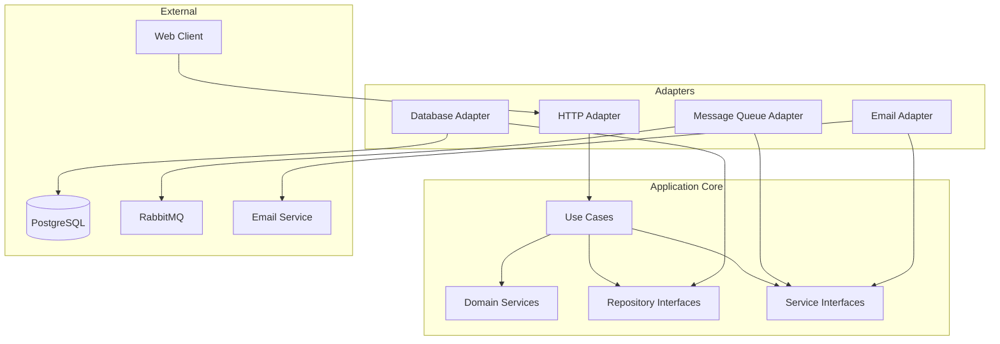
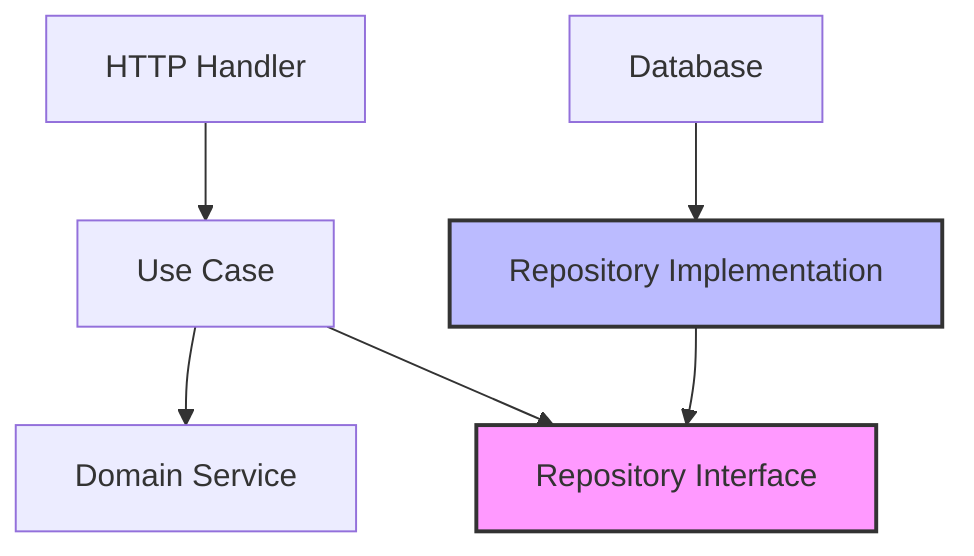

# Authentication Service Architecture Documentation

## Table of Contents
1. [High-Level Architecture Overview](#high-level-architecture-overview)
2. [Project Structure](#project-structure)
3. [Authentication Bounded Context](#authentication-bounded-context)
4. [Architecture Patterns](#architecture-patterns)
5. [Technology Stack](#technology-stack)
6. [Cross-Cutting Concerns](#cross-cutting-concerns)
7. [API Design](#api-design)

---

## High-Level Architecture Overview

### Microservice Pattern
The Authentication Service is designed as a standalone microservice responsible solely for authentication and authorization concerns. This approach provides:

- **Single Responsibility**: Focused exclusively on authentication, authorization, and user identity management
- **Independent Scalability**: Can be scaled independently based on authentication load
- **Technology Isolation**: Can use different technology stacks optimized for security and performance
- **Fault Isolation**: Authentication service failures don't directly impact other business services
- **Team Autonomy**: Dedicated teams can work on authentication without coordinating with other teams

### Clean Architecture Principles
Our implementation follows Robert C. Martin's Clean Architecture principles with four distinct layers:

```
┌─────────────────────────────────────────────────────────────┐
│                        Interfaces                           │
│  (Controllers, API Endpoints, Event Handlers, Presenters)   │
├─────────────────────────────────────────────────────────────┤
│                     Application                             │
│        (Use Cases, Application Services, DTOs)              │
├─────────────────────────────────────────────────────────────┤
│                       Domain                                │
│    (Entities, Value Objects, Domain Services, Repositories) │
├─────────────────────────────────────────────────────────────┤
│                   Infrastructure                            │
│   (Database, External APIs, Message Queues, Caching)        │
└─────────────────────────────────────────────────────────────┘
```

**Dependency Rule**: Dependencies can only point inward. Outer layers depend on inner layers, but inner layers have no knowledge of outer layers.

### Domain-Driven Design Concepts
The authentication service implements DDD principles to model the authentication domain:

#### Bounded Context
The **Authentication Bounded Context** encompasses:
- User identity and credentials
- Authentication mechanisms
- Authorization tokens
- Password management
- Account security policies

#### Ubiquitous Language
Key domain terms used consistently across the service:
- **User**: Entity representing a person with authentication credentials
- **Credentials**: Sensitive information used for authentication (password, tokens)
- **Authentication**: Process of verifying user identity
- **Authorization**: Process of determining access rights
- **Token**: Digital credential for accessing protected resources
- **Session**: Period of authenticated user activity

### Authentication Bounded Context Scope

#### Core Domain Models
- **User**: Central entity with authentication capabilities
- **Credentials**: User's authentication information
- **TokenPair**: Access and refresh token combination
- **PasswordReset**: Password recovery process
- **AccountStatus**: User account state (active, locked, suspended)

#### Domain Services
- **PasswordHashingService**: Secure password hashing and verification
- **TokenGenerationService**: JWT token creation and validation
- **AccountLockoutService**: Failed attempt tracking and account locking
- **EmailVerificationService**: Email verification token management

---

## Project Structure

```
authentication-service/
├── cmd/
│   └── main.go                    # Application entry point
├── internal/                      # Private application code
│   ├── domain/                    # Core business logic
│   │   ├── entities/              # Domain entities
│   │   │   ├── user.go
│   │   │   ├── credentials.go
│   │   │   └── token.go
│   │   ├── valueobjects/          # Value objects
│   │   │   ├── email.go
│   │   │   ├── password.go
│   │   │   ├── username.go
│   │   │   └── token.go
│   │   ├── services/              # Domain services
│   │   │   ├── password_service.go
│   │   │   ├── token_service.go
│   │   │   └── account_service.go
│   │   ├── repositories/          # Repository interfaces
│   │   │   ├── user_repository.go
│   │   │   └── token_repository.go
│   │   └── events/                # Domain events
│   │       ├── user_registered.go
│   │       ├── user_logged_in.go
│   │       └── password_reset.go
│   ├── application/               # Application layer
│   │   ├── usecases/              # Use case implementations
│   │   │   ├── register_user.go
│   │   │   ├── authenticate_user.go
│   │   │   ├── refresh_token.go
│   │   │   ├── reset_password.go
│   │   │   └── update_credentials.go
│   │   ├── dto/                   # Data transfer objects
│   │   │   ├── requests/
│   │   │   └── responses/
│   │   ├── services/              # Application services
│   │   │   └── auth_service.go
│   │   └── validators/            # Request validation
│   │       └── auth_validator.go
│   ├── infrastructure/            # Infrastructure layer
│   │   ├── persistence/           # Database implementations
│   │   │   ├── postgresql/
│   │   │   │   ├── user_repository.go
│   │   │   │   └── token_repository.go
│   │   │   └── migrations/
│   │   ├── cache/                 # Redis caching
│   │   │   └── redis_cache.go
│   │   ├── messaging/             # Message queue
│   │   │   └── rabbitmq/
│   │   ├── external/              # External service clients
│   │   │   └── email_service.go
│   │   └── security/              # Security implementations
│   │       ├── jwt.go
│   │       ├── bcrypt.go
│   │       └── rate_limiter.go
│   ├── interface/                 # Interface layer
│   │   ├── http/                  # HTTP handlers
│   │   │   ├── handlers/
│   │   │   │   ├── auth_handler.go
│   │   │   │   ├── user_handler.go
│   │   │   │   └── password_handler.go
│   │   │   ├── middleware/
│   │   │   │   ├── auth_middleware.go
│   │   │   │   ├── cors_middleware.go
│   │   │   │   └── logging_middleware.go
│   │   │   └── routes/
│   │   │       └── routes.go
│   │   ├── grpc/                  # gRPC handlers (if needed)
│   │   └── events/                # Event handlers
│   │       └── event_handlers.go
│   └── config/                    # Configuration
│       ├── config.go
│       └── env.go
├── pkg/                           # Public libraries
│   ├── errors/                    # Error definitions
│   └── utils/                     # Utility functions
├── docker/                        # Docker configurations
│   ├── Dockerfile.dev
│   └── Dockerfile.prod
├── migration/                     # Database migration files
├── documentation/                 # Documentation
├── tests/                         # Integration and E2E tests
├── scripts/                       # Build and deployment scripts
├── go.mod
├── go.sum
├── .air.toml                      # Air hot reload config
├── .gitignore
└── README.md
```

### Layer Responsibilities

#### Domain Layer (`internal/domain/`)
**Purpose**: Contains the core business logic and domain models, completely independent of technical concerns.

- **Entities**: Core business objects with identity (User, Credentials)
- **Value Objects**: Immutable objects without identity (Email, Password, Username)
- **Domain Services**: Business logic that doesn't naturally fit in entities
- **Repository Interfaces**: Contracts for data persistence
- **Domain Events**: Events that something important happened in the domain

#### Application Layer (`internal/application/`)
**Purpose**: Orchestrates domain objects to fulfill use cases, defines application boundaries.

- **Use Cases**: Application-specific business workflows
- **DTOs**: Data transfer objects for external communication
- **Application Services**: Coordinators that orchestrate use cases
- **Validators**: Input validation logic

#### Infrastructure Layer (`internal/infrastructure/`)
**Purpose**: Provides technical implementations for domain and application layers.

- **Persistence**: Database implementations of repositories
- **External Services**: Third-party API integrations
- **Messaging**: Event publishing and consuming
- **Caching**: Performance optimization layers
- **Security**: Cryptographic and security implementations

#### Interface Layer (`internal/interface/`)
**Purpose**: Handles external communication and converts external formats to internal models.

- **HTTP Handlers**: REST API endpoint implementations
- **Middleware**: Cross-cutting concerns for HTTP requests
- **Event Handlers**: Handles external events
- **Routes**: API routing configuration

---

## Authentication Bounded Context

### Domain Entities

#### User Entity
```go
type User struct {
    id           UserID
    username     Username
    email        Email
    credentials  Credentials
    status       AccountStatus
    createdAt    time.Time
    updatedAt    time.Time
    lastLoginAt  *time.Time
}
```

**Responsibilities**:
- Maintain user identity and profile information
- Manage authentication state
- Enforce business rules for user operations

#### Credentials Entity
```go
type Credentials struct {
    userID          UserID
    passwordHash    string
    failedAttempts  int
    lockedUntil     *time.Time
    lastChangedAt   time.Time
    mustChange      bool
}
```

**Responsibilities**:
- Store secure password information
- Track failed authentication attempts
- Manage account lockout state

#### TokenPair Entity
```go
type TokenPair struct {
    accessToken   AccessToken
    refreshToken  RefreshToken
    userID        UserID
    expiresAt     time.Time
    createdAt     time.Time
}
```

**Responsibilities**:
- Represent JWT token pairs for authentication
- Manage token lifecycle and expiration

### Value Objects

#### Email
```go
type Email struct {
    value string
}

func NewEmail(email string) (Email, error) {
    // Validation logic
    // RFC 5322 compliance
    // Domain validation
}
```

#### Password
```go
type Password struct {
    value string
}

func NewPassword(password string) (Password, error) {
    // Strength validation
    // Complexity requirements
    // Common password checks
}
```

#### Username
```go
type Username struct {
    value string
}

func NewUsername(username string) (Username, error) {
    // Format validation
    // Length requirements
    // Character restrictions
}
```

### Aggregates and Roots

#### User Aggregate
The User is the aggregate root that controls access to related entities:

```go
type UserAggregate struct {
    user        User
    credentials Credentials
    tokens      []TokenPair
}

// Aggregate invariants
func (ua *UserAggregate) Authenticate(password Password) error {
    // Business rule: Cannot authenticate locked accounts
    if ua.credentials.IsLocked() {
        return ErrAccountLocked
    }
    
    // Business rule: Cannot authenticate unverified accounts
    if ua.user.status == StatusUnverified {
        return ErrAccountNotVerified
    }
    
    // Authentication logic
}
```

**Aggregate Invariants**:
- User status and credentials must be consistent
- Failed attempts must be tracked accurately
- Lockout policies must be enforced
- Tokens must be associated with valid users

### Domain Services

#### PasswordHashingService
```go
type PasswordHashingService interface {
    HashPassword(password Password) (string, error)
    VerifyPassword(password Password, hash string) (bool, error)
    IsPasswordStrong(password Password) error
}
```

#### TokenGenerationService
```go
type TokenGenerationService interface {
    GenerateTokenPair(userID UserID) (TokenPair, error)
    ValidateAccessToken(token string) (*TokenClaims, error)
    RefreshAccessToken(refreshToken string) (AccessToken, error)
}
```

#### AccountLockoutService
```go
type AccountLockoutService interface {
    RecordFailedAttempt(userID UserID) error
    IsAccountLocked(userID UserID) (bool, *time.Time)
    ResetFailedAttempts(userID UserID) error
    LockAccount(userID UserID, duration time.Duration) error
}
```

### Repository Interfaces

#### UserRepository
```go
type UserRepository interface {
    FindByID(id UserID) (*User, error)
    FindByEmail(email Email) (*User, error)
    FindByUsername(username Username) (*User, error)
    Save(user *User) error
    Delete(id UserID) error
    ExistsByEmail(email Email) (bool, error)
    ExistsByUsername(username Username) (bool, error)
}
```

#### TokenRepository
```go
type TokenRepository interface {
    Save(tokenPair TokenPair) error
    FindByRefreshToken(token RefreshToken) (*TokenPair, error)
    DeleteByUserID(userID UserID) error
    DeleteExpired() error
}
```

### Application Services

#### AuthService
```go
type AuthService struct {
    userRepo         UserRepository
    tokenRepo        TokenRepository
    passwordService  PasswordHashingService
    tokenService     TokenGenerationService
    lockoutService   AccountLockoutService
    eventPublisher   EventPublisher
}

func (s *AuthService) RegisterUser(req RegisterUserRequest) (*RegisterUserResponse, error) {
    // Use case implementation
}
```

---

## Architecture Patterns

### Hexagonal Architecture (Ports and Adapters)

The authentication service implements hexagonal architecture to decouple business logic from external concerns:



#### Ports (Interfaces)
- **Repository Ports**: Data access interfaces
- **Service Ports**: External service interfaces
- **Event Ports**: Event publishing interfaces

#### Adapters (Implementations)
- **Primary Adapters**: Drive the application (HTTP handlers, gRPC handlers)
- **Secondary Adapters**: Implement ports for external dependencies (database, email, queue)

### Dependency Inversion



**Key Principles**:
- High-level modules don't depend on low-level modules
- Both depend on abstractions (interfaces)
- Abstractions don't depend on details
- Details depend on abstractions

### SOLID Principles Implementation

#### Single Responsibility Principle
Each class has one reason to change:
- `UserRepository` only handles user data persistence
- `PasswordHashingService` only handles password operations
- `AuthHandler` only handles HTTP requests

#### Open/Closed Principle
Open for extension, closed for modification:
- New authentication methods can be added without changing existing code
- New password policies can be added through strategy pattern

#### Liskov Substitution Principle
Subtypes must be substitutable for base types:
- Any `UserRepository` implementation can replace another
- `PostgresUserRepository` and `MongoUserRepository` are interchangeable

#### Interface Segregation Principle
Clients shouldn't depend on unused interfaces:
- `ReadOnlyUserRepository` for read-only operations
- `WriteOnlyUserRepository` for write operations
- `FullUserRepository` combines both when needed

#### Dependency Inversion Principle
Depend on abstractions, not concretions:
- Use cases depend on repository interfaces, not implementations
- Infrastructure implements interfaces defined in domain

### CQRS Implementation

While not strictly necessary for a simple authentication service, we implement partial CQRS for performance optimization:

```go
// Command side - Write operations
type UserCommandHandler interface {
    Register(cmd RegisterUserCommand) error
    UpdateCredentials(cmd UpdateCredentialsCommand) error
    ResetPassword(cmd ResetPasswordCommand) error
}

// Query side - Read operations
type UserQueryHandler interface {
    GetUserByID(query GetUserQuery) (*UserDTO, error)
    GetUserByEmail(query GetUserByEmailQuery) (*UserDTO, error)
    ValidateCredentials(query ValidateCredentialsQuery) (*AuthResult, error)
}
```

**Benefits**:
- Optimized read and write models
- Independent scaling of queries and commands
- Clear separation of concerns

---

## Technology Stack

### Core Framework and Language

#### Go 1.25+
**Rationale**:
- **Performance**: Excellent for high-throughput authentication services
- **Concurrency**: Built-in goroutines for handling simultaneous auth requests
- **Security**: Strong type system and memory safety
- **Ecosystem**: Rich libraries for web development and security
- **Deployment**: Single binary deployment simplifies containerization

#### Key Libraries
- **Gin Framework**: High-performance HTTP router
- **GORM**: ORM for database operations
- **JWT-go**: JWT token implementation
- **Bcrypt**: Password hashing
- **Validator**: Input validation
- **Viper**: Configuration management

### Database Considerations

#### Primary Database: PostgreSQL
**Rationale**:
- **ACID Compliance**: Critical for authentication data integrity
- **JSON Support**: Flexible storage for user metadata
- **Performance**: Excellent for read-heavy authentication queries
- **Security**: Row-level security and encryption support
- **Scalability**: Connection pooling and replication support

#### Database Schema Design
```sql
-- Users table
CREATE TABLE users (
    id UUID PRIMARY KEY DEFAULT gen_random_uuid(),
    username VARCHAR(255) UNIQUE NOT NULL,
    email VARCHAR(255) UNIQUE NOT NULL,
    status VARCHAR(50) NOT NULL DEFAULT 'active',
    created_at TIMESTAMP WITH TIME ZONE DEFAULT NOW(),
    updated_at TIMESTAMP WITH TIME ZONE DEFAULT NOW(),
    last_login_at TIMESTAMP WITH TIME ZONE
);

-- Credentials table
CREATE TABLE credentials (
    user_id UUID PRIMARY KEY REFERENCES users(id) ON DELETE CASCADE,
    password_hash VARCHAR(255) NOT NULL,
    failed_attempts INTEGER DEFAULT 0,
    locked_until TIMESTAMP WITH TIME ZONE,
    last_changed_at TIMESTAMP WITH TIME ZONE DEFAULT NOW(),
    must_change BOOLEAN DEFAULT FALSE
);

-- Tokens table
CREATE TABLE tokens (
    id UUID PRIMARY KEY DEFAULT gen_random_uuid(),
    user_id UUID NOT NULL REFERENCES users(id) ON DELETE CASCADE,
    access_token_hash VARCHAR(255) NOT NULL,
    refresh_token_hash VARCHAR(255) NOT NULL,
    expires_at TIMESTAMP WITH TIME ZONE NOT NULL,
    created_at TIMESTAMP WITH TIME ZONE DEFAULT NOW(),
    revoked_at TIMESTAMP WITH TIME ZONE
);

-- Indexes for performance
CREATE INDEX idx_users_email ON users(email);
CREATE INDEX idx_users_username ON users(username);
CREATE INDEX idx_tokens_user_id ON tokens(user_id);
CREATE INDEX idx_tokens_expires_at ON tokens(expires_at);
```

### Message Queue/Event Bus

#### RabbitMQ
**Rationale**:
- **Reliability**: Persistent message delivery guarantees
- **Flexibility**: Multiple exchange types for different patterns
- **Scalability**: Clustering support for high availability
- **Integration**: Easy integration with other microservices

**Event Types**:
- `UserRegisteredEvent`
- `UserLoggedInEvent`
- `PasswordResetRequestedEvent`
- `AccountLockedEvent`
- `CredentialsUpdatedEvent`

### Security Implementations

#### JWT Implementation
```go
type JWTConfig struct {
    SecretKey        string        `json:"secret_key"`
    AccessDuration   time.Duration `json:"access_duration"`
    RefreshDuration  time.Duration `json:"refresh_duration"`
    Issuer           string        `json:"issuer"`
    Algorithm        string        `json:"algorithm"`
}

type Claims struct {
    UserID    string    `json:"user_id"`
    Email     string    `json:"email"`
    Username  string    `json:"username"`
    Role      string    `json:"role"`
    TokenID   string    `json:"jti"`
    IssuedAt  int64     `json:"iat"`
    ExpiresAt int64     `json:"exp"`
    Issuer    string    `json:"iss"`
}
```

#### Password Security
```go
type PasswordConfig struct {
    MinLength        int           `json:"min_length"`
    RequireNumbers   bool          `json:"require_numbers"`
    RequireSymbols   bool          `json:"require_symbols"`
    RequireUppercase bool          `json:"require_uppercase"`
    RequireLowercase bool          `json:"require_lowercase"`
    MaxAge           time.Duration `json:"max_age"`
    HistoryCount     int           `json:"history_count"`
}
```

---

## Cross-Cutting Concerns

### Authentication and Authorization

#### JWT-Based Authentication
```go
type AuthenticationMiddleware struct {
    tokenService TokenService
    userRepo     UserRepository
}

func (m *AuthenticationMiddleware) Authenticate() gin.HandlerFunc {
    return func(c *gin.Context) {
        token := extractToken(c)
        claims, err := m.tokenService.ValidateAccessToken(token)
        if err != nil {
            c.JSON(401, ErrorResponse{Error: "Invalid token"})
            c.Abort()
            return
        }
        
        user, err := m.userRepo.FindByID(claims.UserID)
        if err != nil || user.Status() != StatusActive {
            c.JSON(401, ErrorResponse{Error: "User not found or inactive"})
            c.Abort()
            return
        }
        
        c.Set("user", user)
        c.Next()
    }
}
```

#### Role-Based Authorization
```go
type AuthorizationMiddleware struct{}

func (m *AuthorizationMiddleware) RequireRole(roles ...string) gin.HandlerFunc {
    return func(c *gin.Context) {
        user, exists := c.Get("user")
        if !exists {
            c.JSON(401, ErrorResponse{Error: "User not authenticated"})
            c.Abort()
            return
        }
        
        if !hasRequiredRole(user, roles) {
            c.JSON(403, ErrorResponse{Error: "Insufficient permissions"})
            c.Abort()
            return
        }
        
        c.Next()
    }
}
```

### Validation

#### Request Validation
```go
type RegisterRequest struct {
    Username       string `json:"username" binding:"required,min=3,max=255,alphanum"`
    Email          string `json:"email" binding:"required,email"`
    Password       string `json:"password" binding:"required,min=8"`
    ConfirmPassword string `json:"confirm_password" binding:"required,eqfield=Password"`
}

type CustomValidator struct {
    userRepo UserRepository
}

func (v *CustomValidator) ValidatePasswordComplexity(fl validator.FieldLevel) bool {
    password := fl.Field().String()
    // Custom password complexity validation
    return hasNumber(password) && hasSymbol(password)
}

func (v *CustomValidator) ValidateUniqueEmail(fl validator.FieldLevel) bool {
    email := fl.Field().String()
    exists, _ := v.userRepo.ExistsByEmail(Email{value: email})
    return !exists
}
```

### Error Handling

#### Domain-Specific Errors
```go
type DomainError struct {
    Code    string `json:"code"`
    Message string `json:"message"`
    Details map[string]interface{} `json:"details,omitempty"`
}

func (e DomainError) Error() string {
    return e.Message
}

var (
    ErrUserNotFound       = DomainError{Code: "USER_NOT_FOUND", Message: "User not found"}
    ErrInvalidCredentials = DomainError{Code: "INVALID_CREDENTIALS", Message: "Invalid username or password"}
    ErrAccountLocked      = DomainError{Code: "ACCOUNT_LOCKED", Message: "Account is locked"}
    ErrTokenExpired       = DomainError{Code: "TOKEN_EXPIRED", Message: "Token has expired"}
)
```

#### Global Error Handler
```go
func ErrorHandler() gin.HandlerFunc {
    return func(c *gin.Context) {
        c.Next()
        
        for _, err := range c.Errors {
            switch e := err.Err.(type) {
            case DomainError:
                c.JSON(getHTTPStatusForError(e), ErrorResponse{
                    Success: false,
                    Error:   e,
                })
            case validator.ValidationErrors:
                c.JSON(400, ValidationErrorResponse{
                    Success: false,
                    Error:   "Validation failed",
                    Details: formatValidationErrors(e),
                })
            default:
                c.JSON(500, ErrorResponse{
                    Success: false,
                    Error:   "Internal server error",
                })
            }
        }
    }
}
```

### Logging

#### Structured Logging
```go
type Logger interface {
    Info(msg string, fields ...Field)
    Error(msg string, err error, fields ...Field)
    Debug(msg string, fields ...Field)
    Warn(msg string, fields ...Field)
}

type AuthenticationLogger struct {
    logger Logger
}

func (l *AuthenticationLogger) LogLoginAttempt(userID string, success bool, ip string) {
    fields := []Field{
        String("user_id", userID),
        Bool("success", success),
        String("ip", ip),
        String("action", "login_attempt"),
    }
    
    if success {
        l.logger.Info("User login successful", fields...)
    } else {
        l.logger.Warn("User login failed", fields...)
    }
}
```

### Rate Limiting

#### Token Bucket Rate Limiter
```go
type RateLimiter interface {
    Allow(key string) bool
    GetRemainingTokens(key string) int
    Reset(key string)
}

type AuthenticationRateLimiter struct {
    loginLimiter    RateLimiter  // 5 attempts per minute
    registerLimiter RateLimiter  // 3 attempts per 5 minutes
    resetLimiter    RateLimiter  // 3 attempts per hour
}

func (r *AuthenticationRateLimiter) CheckLoginRate(ip string, userID string) bool {
    // Check both IP-based and user-based rate limiting
    return r.loginLimiter.Allow("login:ip:"+ip) && 
           r.loginLimiter.Allow("login:user:"+userID)
}
```

---

## API Design

### RESTful Principles

#### Resource Naming
- `/api/v1/auth/login` - Authentication endpoint
- `/api/v1/auth/register` - User registration
- `/api/v1/auth/refresh` - Token refresh
- `/api/v1/auth/logout` - Session termination
- `/api/v1/auth/password/reset` - Password reset request
- `/api/v1/auth/password/confirm` - Password reset confirmation
- `/api/v1/users/me` - Current user profile
- `/api/v1/users/me/credentials` - Update credentials

#### HTTP Method Usage
- `POST` - Create resources (register, login, password reset)
- `GET` - Retrieve resources (user profile)
- `PUT` - Update resources (credentials)
- `DELETE` - Remove resources (logout, revoke tokens)

### Endpoint Organization

#### Authentication Endpoints
```go
// Authentication group
auth := v1.Group("/auth")
{
    auth.POST("/login", authHandler.Login)
    auth.POST("/register", authHandler.Register)
    auth.POST("/refresh", authHandler.RefreshToken)
    auth.POST("/logout", authMiddleware.Authenticate(), authHandler.Logout)
    auth.POST("/verify", authHandler.VerifyEmail)
    
    // Password management
    passwords := auth.Group("/password")
    {
        passwords.POST("/reset", passwordHandler.RequestReset)
        passwords.POST("/confirm", passwordHandler.ConfirmReset)
        passwords.PUT("/change", authMiddleware.Authenticate(), passwordHandler.ChangePassword)
    }
}
```

#### User Management Endpoints
```go
// User management group
users := v1.Group("/users")
users.Use(authMiddleware.Authenticate())
{
    users.GET("/me", userHandler.GetCurrentUser)
    users.PUT("/me", userHandler.UpdateProfile)
    users.DELETE("/me", userHandler.DeleteAccount)
    
    credentials := users.Group("/credentials")
    {
        credentials.PUT("/", userHandler.UpdateCredentials)
        credentials.POST("/change-password", userHandler.ChangePassword)
    }
}
```

### Request/Response Patterns

#### Standard Response Format
```go
type APIResponse struct {
    Success bool        `json:"success"`
    Data    interface{} `json:"data,omitempty"`
    Error   *APIError   `json:"error,omitempty"`
    Meta    *Meta       `json:"meta,omitempty"`
}

type APIError struct {
    Code    string                 `json:"code"`
    Message string                 `json:"message"`
    Details map[string]interface{} `json:"details,omitempty"`
}

type Meta struct {
    Timestamp time.Time `json:"timestamp"`
    RequestID string    `json:"request_id"`
    Version   string    `json:"version"`
}
```

#### Success Response Example
```json
{
    "success": true,
    "data": {
        "message": "Login successful",
        "user": {
            "id": "550e8400-e29b-41d4-a716-446655440000",
            "username": "john_doe",
            "email": "john@example.com",
            "status": "active"
        },
        "tokens": {
            "access_token": "eyJhbGciOiJIUzI1NiIs...",
            "refresh_token": "eyJhbGciOiJIUzI1NiIs...",
            "expires_in": 3600
        }
    },
    "meta": {
        "timestamp": "2023-12-05T10:30:00Z",
        "request_id": "req_123456789",
        "version": "v1"
    }
}
```

#### Error Response Example
```json
{
    "success": false,
    "error": {
        "code": "VALIDATION_ERROR",
        "message": "Request validation failed",
        "details": {
            "username": "Username is required",
            "email": "Invalid email format"
        }
    },
    "meta": {
        "timestamp": "2023-12-05T10:30:00Z",
        "request_id": "req_123456789",
        "version": "v1"
    }
}
```

### Versioning Strategy

#### URL Versioning
We use URL path versioning for clear API version separation:
- `/api/v1/auth/login` - Version 1
- `/api/v2/auth/login` - Version 2 (future)

#### Version Compatibility
- **Backward Compatibility**: v1 endpoints remain functional
- **Deprecation Headers**: Clear deprecation warnings for old versions
- **Migration Path**: Smooth transition between versions

#### Version Selection
```go
func VersionMiddleware() gin.HandlerFunc {
    return func(c *gin.Context) {
        version := c.Param("version")
        switch version {
        case "v1":
            c.Set("api_version", "v1")
        case "v2":
            c.Set("api_version", "v2")
        default:
            c.JSON(400, ErrorResponse{
                Success: false,
                Error:   "Unsupported API version",
            })
            c.Abort()
            return
        }
        c.Next()
    }
}
```

---

## Conclusion

This architecture documentation provides a comprehensive foundation for implementing a robust, scalable, and maintainable authentication microservice. The clean architecture approach ensures that the business logic remains isolated from technical concerns, while the microservice pattern allows for independent deployment and scaling.

Key architectural benefits:
- **Maintainability**: Clear separation of concerns makes the code easier to understand and modify
- **Testability**: Dependency inversion enables comprehensive unit testing
- **Scalability**: Microservice architecture allows independent scaling
- **Security**: Layered approach provides multiple security barriers
- **Flexibility**: Hexagonal architecture enables easy technology swapping

The implementation follows industry best practices and patterns, ensuring a professional-grade authentication service that can serve as the security foundation for larger distributed systems.