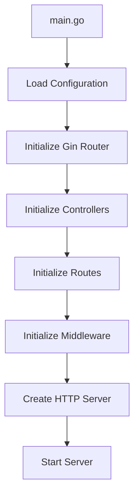

# API Gateway Architecture Documentation

## Table of Contents
1. [High-Level Architecture Overview](#high-level-architecture-overview)
2. [Project Structure](#project-structure)
3. [Bootstrap and Initialization](#bootstrap-and-initialization)
4. [Module Organization](#module-organization)
5. [Shared Components](#shared-components)
6. [Technology Stack](#technology-stack)
7. [API Design](#api-design)

---

## High-Level Architecture Overview

### Modular Architecture
The API Gateway is implemented using a modular architecture that organizes code by features and responsibilities. This approach emphasizes:

- **Feature-based Organization**: Each business feature (like health checks) is contained within its own module
- **Separation of Concerns**: Clear boundaries between infrastructure, interface, modules, and shared utilities
- **Simple Dependency Flow**: Dependencies flow inward from main application entry point
- **Maintainability**: Easy to add new features and modify existing ones without affecting other parts

### Architecture Layers
The codebase is organized into four main layers:

```
┌─────────────────────────────────────────────────────────────┐
│                        Interface                            │
│  (HTTP Routes, Middleware, External Communication)          │
├─────────────────────────────────────────────────────────────┤
│                       Modules                               │
│   (Feature-specific Controllers, Routers, Types)            │
├─────────────────────────────────────────────────────────────┤
│                     Infrastructure                          │
│   (HTTP Server, Configuration, External Services)           │
├─────────────────────────────────────────────────────────────┤
│                       Shared                                │
│   (Common Types, Responses, Utilities)                      │
└─────────────────────────────────────────────────────────────┘
```

### Application-Driven Design Concepts
The API Gateway implements application-focused design principles:

#### Bounded Context
The **Gateway Application Context** encompasses:
- Request routing and forwarding logic
- Protocol translation and transformation processing
- Authentication and authorization enforcement
- Rate limiting and throttling policies
- Load balancing and service discovery coordination
- API composition and aggregation workflows
- Circuit breaking and fault tolerance mechanisms
- Request/response caching strategies

#### Ubiquitous Language
Key application terms used consistently across the gateway:
- **Route**: Mapping configuration from incoming request paths to backend services
- **Service**: Backend service endpoint representation with discovery and health information
- **Middleware**: Processing components that handle cross-cutting concerns
- **Policy**: Configuration rules for routing, security, and traffic management
- **Pipeline**: Ordered sequence of middleware applied to requests
- **Transformation**: Request/response modification and protocol conversion
- **Circuit**: Fault isolation mechanism for backend service protection
- **Endpoint**: Configured API route with specific behavior and policies

---

## Project Structure

```
api-gateway/
├── cmd/
│   └── main.go                    # Application entry point
├── internal/                      # Private application code
│   ├── bootstrap/                 # Application bootstrap
│   │   └── controller/
│   │       ├── health.go          # Health controller initialization
│   │       └── init.go            # Controller registry
│   ├── infrastructure/            # Infrastructure setup
│   │   ├── config/
│   │   │   └── load.go            # Configuration loading
│   │   └── http/
│   │       ├── api/
│   │       │   ├── init.go        # HTTP server setup
│   │       │   └── start.go       # Server startup
│   │       └── gin/
│   │           └── init.go        # Gin router initialization
│   ├── interface/                 # Interface adapters
│   │   ├── middleware/
│   │   │   └── init.go            # Middleware initialization
│   │   └── router/
│   │       ├── init.go            # Main router setup
│   │       └── v1/
│   │           └── init.go        # Version 1 API routes
│   ├── modules/                   # Feature modules
│   │   └── health/                # Health check module
│   │       ├── constant/
│   │       │   └── response.go    # Module constants
│   │       ├── controller/
│   │       │   └── check.go       # Health controller logic
│   │       ├── router/
│   │       │   └── v1/
│   │       │       ├── get.go     # GET route handlers
│   │       │       └── init.go    # Health router setup
│   │       └── types/
│   │           └── controller.go  # Module type definitions
│   └── shared/                    # Shared utilities
│       ├── response/
│       │   ├── error.go           # Error response helpers
│       │   └── success.go         # Success response helpers
│       ├── types/
│       │   ├── config.go          # Configuration types
│       │   └── response.go        # Response types
│       └── util/
│           └── env/               # Environment utilities
│               ├── get.go
│               ├── string_to_int.go
│               └── string_to_int_64.go
├── docker/                        # Docker configurations
│   ├── Dockerfile.dev
│   └── Dockerfile.prod
├── documentation/                 # Documentation
├── go.mod
├── go.sum
├── .air.toml                      # Air hot reload config
├── .gitignore
└── README.md
```

### Directory Responsibilities

#### Bootstrap (`internal/bootstrap/`)
**Purpose**: Initializes and wires together all application components.

- **Controller Registry**: Creates and configures all module controllers
- **Dependency Injection**: Provides controllers to routers and other components

#### Infrastructure (`internal/infrastructure/`)
**Purpose**: Handles technical concerns and external service integrations.

- **Configuration**: Loads environment variables and application settings
- **HTTP Server**: Sets up and configures the HTTP server with timeouts and limits
- **Gin Router**: Initializes the Gin web framework with default middleware

#### Interface (`internal/interface/`)
**Purpose**: Defines how the application interacts with external systems.

- **Middleware**: Cross-cutting concerns like logging, CORS, authentication
- **Router**: HTTP route definitions and API versioning

#### Modules (`internal/modules/`)
**Purpose**: Feature-specific business logic organized by domain.

Each module contains:
- **Controller**: Business logic for handling requests
- **Router**: Route definitions and HTTP method mappings
- **Types**: Module-specific type definitions
- **Constants**: Module-specific constants and messages

#### Shared (`internal/shared/`)
**Purpose**: Common utilities and types used across the application.

- **Response Helpers**: Standardized success and error response formatting
- **Types**: Shared data structures (Config, Response)
- **Utilities**: Environment variable parsing and common functions

---

## Bootstrap and Initialization

### Application Startup Flow

The application follows a simple initialization sequence starting from `main.go`:



### Main Entry Point

```go
func main() {
    // Load configuration from environment variables
    cfg := config.Load()
    
    // Initialize Gin web framework
    gin := gin.Init(cfg)
    
    // Create and initialize all controllers
    controller := controller.Init()
    
    // Setup routes with controllers
    router.Init(gin, controller)
    
    // Apply middleware
    middleware.Init(gin)
    
    // Create HTTP server with configuration
    httpServer := api.Init(gin, cfg)
    
    // Start the server
    api.Start(httpServer)
}
```

### Configuration Loading

Configuration is loaded from environment variables using the `config.Load()` function:

```go
func Load() *types.Config {
    return &types.Config{
        ReadTimeout:        env.StringToInt64(env.Get("READ_TIMEOUT")),
        WriteTimeout:       env.StringToInt64(env.Get("WRITE_TIMEOUT")),
        IdleTimeout:        env.StringToInt64(env.Get("IDLE_TIMEOUT")),
        MaxHeaderBytes:     env.StringToInt64(env.Get("MAX_HEADER_BYTES")),
        MinMultipartMemory: env.StringToInt64(env.Get("MIN_MULTIPART_MEMORY")),
        MaxMultipartMemory: env.StringToInt64(env.Get("MAX_MULTIPART_MEMORY")),
        HTTPPort:           env.StringToInt(env.Get("HTTP_PORT")),
    }
}
```

### Controller Initialization

The bootstrap process creates a controller registry that holds all module controllers:

```go
type Controller struct {
    Health *types.HealthController
}

func Init() *Controller {
    healthController := InitHeatlhController()
    
    return &Controller{
        Health: healthController,
    }
}
```

Each module's controller is initialized by creating the business logic and wrapping it in a typed controller structure.

---

## Module Organization

### Module Structure

Each feature module follows a consistent structure with four main components:

```
modules/{module-name}/
├── constant/          # Module-specific constants
├── controller/        # Business logic handlers
├── router/           # HTTP route definitions
│   └── v1/           # API version routes
└── types/            # Module type definitions
```

### Health Module Example

#### Module Types
```go
// types/controller.go
package types

import "moufube.com/m/internal/modules/health/controller"

type HealthController struct {
    Check *controller.Check
}
```

#### Controller Implementation
```go
// controller/check.go
package controller

import (
    "github.com/gin-gonic/gin"
    "moufube.com/m/internal/modules/health/constant"
    "moufube.com/m/internal/shared/response"
)

type Check struct{}

func NewCheck() *Check {
    return &Check{}
}

func (ch *Check) Execute(c *gin.Context) {
    response.Success(c, constant.InstanceHealthy, nil)
}
```

#### Router Setup
```go
// router/v1/init.go
func InitHealthRoute(rootV1 *gin.RouterGroup, healthController *types.HealthController) {
    rootHealth := rootV1.Group("health")
    InitHealthGetRoute(rootHealth, healthController)
}

// router/v1/get.go
func InitHealthGetRoute(rootHealth *gin.RouterGroup, healthController *types.HealthController) {
    rootHealth.GET("", healthController.Check.Execute)
}
```

#### Module Constants
```go
// constant/response.go
const (
    InstanceHealthy = "Instance is healthy."
)
```

### Adding New Modules

To add a new module:

1. **Create Module Structure**:
   ```
   internal/modules/{new-module}/
   ├── constant/
   ├── controller/
   ├── router/v1/
   └── types/
   ```

2. **Implement Controller**:
   - Create business logic in `controller/`
   - Define types in `types/controller.go`

3. **Setup Routes**:
   - Add route initialization in `router/v1/`
   - Register routes in main router

4. **Update Bootstrap**:
   - Add controller to `bootstrap/controller/`
   - Include in main router initialization

5. **Add Constants**:
   - Define module-specific constants

### Module Communication

Modules communicate through:
- **Shared Types**: Common data structures in `internal/shared/types/`
- **Response Helpers**: Standardized response formatting
- **Configuration**: Environment-based configuration loading
- **Bootstrap Registry**: Controllers passed to routers during initialization

---

## Shared Components

### Response Handling

The application uses standardized response formatting across all endpoints:

#### Response Types
```go
// shared/types/response.go
type Response struct {
    Success bool   `json:"success"`
    Message string `json:"message"`
    Data    any    `json:"data,omitempty"`
    Error   any    `json:"error,omitempty"`
}
```

#### Success Response Helper
```go
// shared/response/success.go
func Success(c *gin.Context, message string, data any) {
    response := &types.Response{
        Success: true,
        Message: message,
        Data:    data,
    }
    c.JSON(http.StatusOK, response)
}
```

#### Error Response Helper
```go
// shared/response/error.go
func Error(c *gin.Context, message string, data any) {
    response := &types.Response{
        Success: false,
        Message: message,
        Data:    data,
    }
    c.JSON(http.StatusBadRequest, response)
}
```

### Configuration Management

Configuration is managed through environment variables:

#### Configuration Types
```go
// shared/types/config.go
type Config struct {
    ReadTimeout        int64
    WriteTimeout       int64
    IdleTimeout        int64
    MaxHeaderBytes     int64
    MinMultipartMemory int64
    MaxMultipartMemory int64
    HTTPPort           int
}
```

#### Environment Utilities
```go
// shared/util/env/get.go
func Get(key string) string {
    return os.Getenv(key)
}

// shared/util/env/string_to_int.go
func StringToInt(s string) int {
    // Implementation
}

// shared/util/env/string_to_int_64.go
func StringToInt64(s string) int64 {
    // Implementation
}
```

### HTTP Server Configuration

The HTTP server is configured with environment-based timeouts and limits:

```go
// infrastructure/http/api/init.go
func Init(gin *gin.Engine, cfg *types.Config) *http.Server {
    srv := &http.Server{
        Addr:           fmt.Sprintf(":%d", cfg.HttpPort),
        Handler:        gin,
        ReadTimeout:    time.Duration(cfg.ReadTimeout) * time.Second,
        WriteTimeout:   time.Duration(cfg.WriteTimeout) * time.Second,
        IdleTimeout:    time.Duration(cfg.IdleTimeout) * time.Second,
        MaxHeaderBytes: 1 << cfg.MaxHeaderBytes,
    }
    return srv
}
```

### Router Structure

Routes are organized with clear API versioning:

```go
// interface/router/init.go
func Init(gin *gin.Engine, controller *controller.Controller) {
    root := gin.Group("api")
    v1.InitV1Routes(root, controller)
}

// interface/router/v1/init.go
func InitV1Routes(root *gin.RouterGroup, controller *controller.Controller) {
    rootV1 := root.Group("v1")
    v1.InitHealthRoute(rootV1, controller.Health)
}
```

---

## Technology Stack

### Core Technologies

#### Go
- **Version**: Go (based on go.mod)
- **Purpose**: Primary programming language for the API Gateway
- **Benefits**:
  - High performance and low memory footprint
  - Excellent concurrency support with goroutines
  - Strong standard library for HTTP and networking
  - Single binary deployment simplifies containerization

#### Gin Web Framework
```go
// infrastructure/http/gin/init.go
func Init(cfg *types.Config) *gin.Engine {
    router := gin.Default()
    router.SetTrustedProxies(nil)
    router.MaxMultipartMemory = cfg.MinMultipartMemory << cfg.MaxMultipartMemory
    return router
}
```

**Features Used**:
- Default middleware (logging, recovery)
- Router grouping for API versioning
- JSON response handling
- Request context management

### Development Tools

#### Air (Hot Reload)
- **Configuration**: `.air.toml`
- **Purpose**: Automatic application restart on code changes during development
- **Benefits**: Faster development cycle, immediate feedback on changes

#### Docker
- **Development**: `docker/Dockerfile.dev`
- **Production**: `docker/Dockerfile.prod`
- **Purpose**: Containerization for consistent deployment across environments

### Environment Configuration

The application is configured entirely through environment variables:

| Variable | Type | Description |
|----------|------|-------------|
| `HTTP_PORT` | int | Port for the HTTP server to listen on |
| `READ_TIMEOUT` | int64 | HTTP server read timeout in seconds |
| `WRITE_TIMEOUT` | int64 | HTTP server write timeout in seconds |
| `IDLE_TIMEOUT` | int64 | HTTP server idle timeout in seconds |
| `MAX_HEADER_BYTES` | int64 | Maximum header size (used as bit shift) |
| `MIN_MULTIPART_MEMORY` | int64 | Minimum memory for multipart forms |
| `MAX_MULTIPART_MEMORY` | int64 | Maximum memory for multipart forms |

### Auto-Loading Environment Variables

```go
// cmd/main.go
import _ "github.com/joho/godotenv/autoload"
```

The application automatically loads `.env` files if present, making local development easier while maintaining environment variable priority for production deployments.

---

## API Design

### Current API Endpoints

Based on the current implementation, the API Gateway exposes the following endpoints:

#### Health Check API
```http
GET /api/v1/health
```

**Response Format**:
```json
{
  "success": true,
  "message": "Instance is healthy.",
  "data": null
}
```

**Implementation**:
- Route: `/api/v1/health`
- Handler: `healthController.Check.Execute`
- Returns standardized success response with health message

### API Structure

#### URL Structure
All API endpoints follow the pattern:
```
/api/{version}/{module}/{action}
```

**Current Routes**:
- `/api/v1/health` - Health check endpoint

#### Versioning Strategy
- **URL Path Versioning**: API versions are included in the URL path
- **Current Version**: `v1`
- **Future Versions**: Can be added as `v2`, `v3`, etc.

### Request/Response Patterns

#### Standard Response Format
All API responses follow a consistent JSON structure:

```go
// shared/types/response.go
type Response struct {
    Success bool   `json:"success"`
    Message string `json:"message"`
    Data    any    `json:"data,omitempty"`
    Error   any    `json:"error,omitempty"`
}
```

#### Success Response Example
```json
{
  "success": true,
  "message": "Instance is healthy.",
  "data": null
}
```

#### Error Response Example
```json
{
  "success": false,
  "message": "Error message",
  "data": null,
  "error": "additional error details"
}
```

### Adding New Endpoints

To add new API endpoints:

1. **Create Module Structure** (if new module):
   ```
   internal/modules/{new-module}/
   ├── constant/
   ├── controller/
   ├── router/v1/
   └── types/
   ```

2. **Implement Controller Logic**:
   - Add business logic to controller
   - Use shared response helpers for consistent formatting

3. **Define Routes**:
   - Add route definitions in `router/v1/`
   - Register with main router in `interface/router/v1/`

4. **Update Bootstrap**:
   - Add controller to bootstrap initialization
   - Include in router setup

---

## Conclusion

This architecture documentation accurately reflects the current implementation of the API Gateway, focusing on the actual modular structure rather than aspirational designs. The codebase demonstrates a practical approach to building maintainable Go applications with clear separation of concerns.

Key characteristics of the current architecture:

- **Modular Design**: Features are organized into self-contained modules
- **Simple Bootstrap**: Straightforward initialization sequence from main.go
- **Shared Utilities**: Common functionality centralized for reuse
- **Environment-Driven**: Configuration managed through environment variables
- **Consistent Responses**: Standardized API response formatting
- **HTTP Focus**: Built specifically for HTTP API Gateway use cases

The implementation provides a solid foundation that can be extended with additional features like authentication, rate limiting, service discovery, and load balancing as business requirements evolve. The modular structure makes it easy to add new features without disrupting existing functionality.